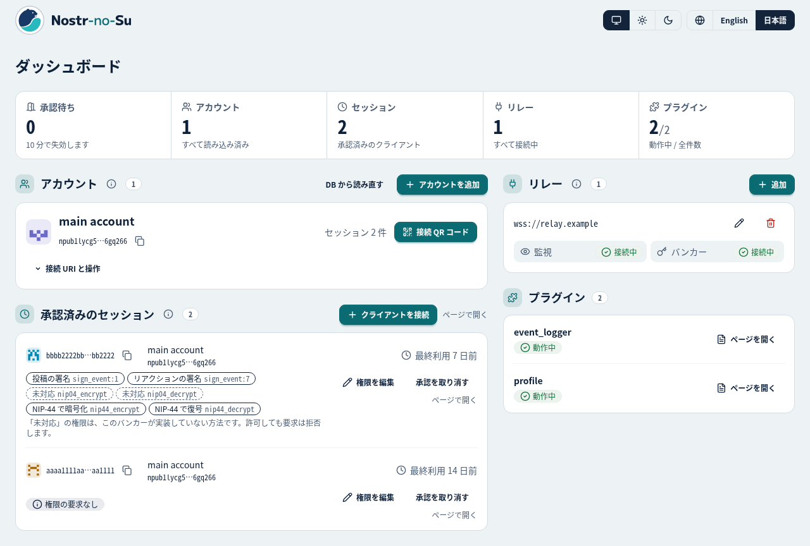

<p align="right"><a href="README.md">English</a> | 日本語</p>

<p align="center">
  <picture>
    <source media="(prefers-color-scheme: dark)" srcset="assets/logo/nostr-no-su-color-dark.svg">
    
  </picture>
</p>

<h1 align="center">Nostr-no-Su</h1>

<p align="center">
  Nostr の秘密鍵をクライアントごとに渡さず、自分のサーバーでまとめて管理。接続の承認も、自分の投稿の収集も、ひとつの「巣」で。
</p>

<p align="center">
  Nostr-no-Su - <em>Nostr の巣</em> - は、複数アカウントに対応した NIP-46 のリモート署名バンカー兼、自分のイベントを処理するユーティリティサーバー。Gleam / BEAM 製。
</p>

<p align="center">
  <a href="https://github.com/neverclear86/nostr-no-su/actions/workflows/ci.yml"></a>
  
  <a href="https://github.com/neverclear86/nostr-no-su/releases"></a>
  <a href="https://github.com/neverclear86/nostr-no-su/pkgs/container/nostr-no-su"></a>
  
  
  <a href="LICENSE"></a>
</p>


*アカウント、接続の承認、リレーをまとめて管理する画面。*

## ✨ 特徴

- 🔐 **NIP-46 バンカー**：複数アカウントの鍵を 1 台で管理。複数リレー対応
- 🛂 **接続の承認と権限の管理**：クライアントごとに接続を承認し、署名できる kind と NIP-44 の暗号化を管理 UI で編集
- 🗝️ **鍵は暗号化して保存**：AES-256-GCM + マスターキー。Postgres に保存
- 📡 **イベントの収集とプラグイン処理**：自分のイベントを複数リレーから集め、検証と重複排除をしてプラグインへ。同梱の `event_logger` は Postgres に保存し、管理 UI のタイムラインで確認できる。自作は BEAM のモジュールを置くだけ
- 🖥️ **管理 UI**：アカウント、接続の承認、セッション、リレー、プラグインを 1 画面で。日英、ライト / ダーク、外部ファイルなし
- 🔁 **障害からの自動復帰**：OTP のスーパービジョンツリー。リレーは個別に再接続、DB が落ちても再試行
- 🔏 **暗号は自前実装、公式テストベクターで検証**：BIP-340 / NIP-44 v2。NIF 不要。前提と既知の制約は [設計上の判断と既知の制約](docs/design-decisions.md) の「v0.1 のセキュリティの前提」

## 🚀 インストール

必要なもの: docker（compose v2）、`curl`、`openssl`。イメージは `linux/amd64` と `linux/arm64`。

公開イメージから:

```sh
mkdir nostr-no-su && cd nostr-no-su
base=https://raw.githubusercontent.com/neverclear86/nostr-no-su/v<version>   # X.Y.Z は Releases から
curl -fsSLO "$base/docker-compose.release.yml"
curl -fsSLO "$base/.env.example"
curl -fsSLO "$base/setup-env.sh"
mkdir -p plugins
sh setup-env.sh
docker compose -f docker-compose.release.yml up -d
```

ソースから:

```sh
git clone https://github.com/neverclear86/nostr-no-su.git && cd nostr-no-su
sh setup-env.sh
docker compose up --build -d
```

`http://127.0.0.1:8080/` を開く。ユーザー名は `admin`、パスワードは `.env` の `ADMIN_PASSWORD`。
最初の流れは、リレーとアカウントを登録 → 接続 URI をクライアントに貼る、の 2 段階（他人の端末に渡すときだけ承認が挟まる）。詳しい手順は [使い方](docs/usage.md) にある。

VPS や自宅サーバーなどリモートのホストで動かすときは、管理 UI はそのホストのループバックにだけ公開されるので、`ssh -L 8080:127.0.0.1:8080 <ホスト>` でポートを転送してから手元のブラウザーで `http://127.0.0.1:8080/` を開く。受信用にポートを開ける必要は無い（バンカーと監視はリレーへの外向きの WebSocket だけで動く）。secret 無しの接続 URI を別の端末のクライアントに渡すときは、その端末のブラウザーから管理 UI の承認ページに到達できる必要があるため、TLS のリバースプロキシーを前に置いて `ADMIN_BASE_URL` に公開 URL を設定する（[設定](docs/configuration.md) の「リバースプロキシーの設定」）。メモリとディスクの目安は [運用](docs/operations.md) の「リソース」にある。

## ⚙️ 設定

設定は `.env` の環境変数。必須はマスターキーと管理パスワードだけで、`setup-env.sh` が生成する。

| 変数 | 既定 | 用途 |
| --- | --- | --- |
| `ADMIN_PORT` | `8080` | 管理 UI のポート。空で無効 |
| `ADMIN_BASE_URL` | `http://localhost:<ADMIN_PORT>` | 承認ページの URL の土台。リバースプロキシーの公開 URL |
| `POSTGRES_USER` / `POSTGRES_PASSWORD` / `POSTGRES_DB` | `nostr` / `nostr` / `nostr_no_su` | 同梱 Postgres の資格情報。効くのは初回起動だけ |

全部の変数、秘密をファイルで渡す方法、リバースプロキシーは [設定](docs/configuration.md)。

## 🔐 安全に使うために

- **マスターキーを失うと鍵が戻らない**：`ACCOUNT_MASTER_KEY` はバックアップと別の場所に。DB のダンプと揃うと全鍵が漏れる
- **管理 UI は平文 HTTP**：既定はループバックだけに公開。外に出すなら TLS を終端するリバースプロキシーを前に
- **プラグインは本体と同じ権限**：サンドボックスなし。信頼できるものだけ置く
- **`REMSH_ENABLED` は使うときだけ**：exec できる者が復号済みの鍵に到達できる

前提と、あえて対策していない項目は [設計上の判断と既知の制約](docs/design-decisions.md) の「v0.1 のセキュリティの前提」。

## 📚 文書

- [使い方](docs/usage.md)：リレーとアカウントの登録、クライアントの接続と承認、権限、event_logger
- [設定](docs/configuration.md)：環境変数の表、`.env`、秘密をファイルで渡す、リバースプロキシー、docker compose の構成
- [運用](docs/operations.md)：起動時のログ、バックアップ、版の更新、復旧、マスターキーの保管と交換、リソースの目安
- [管理 UI](docs/admin-ui.md)：画面の構成、アカウントの操作と結果、接続の承認（auth_url フロー）
- [プラグイン API v1](docs/plugin-api.md)：自作プラグインの仕様。例は [`examples/plugins/`](examples/plugins/)、同梱のプラグインは [`plugins-src/`](plugins-src/)
- [設計上の判断と既知の制約](docs/design-decisions.md)：本体の形を決めた判断とその理由、残っている制約
- [システム構成](docs/architecture.md)：プロセス、イベントとリクエストの経路、ディレクトリ構造、設定の読み手
- [開発](docs/development.md)：ローカルでの実行とテスト、テストの流儀、管理 UI の CSS のビルドと画面の撮影
- [貢献の手引き](CONTRIBUTING.md)：変更の出し方、版数の方針、リリースの手順
- [変更履歴](CHANGELOG.md)：リリースごとの変更

## ライセンス

[MIT License](LICENSE)。
`vendor/stratus/` は Apache License 2.0 の stratus の改変版（帰属は [NOTICE](NOTICE)、改変は [vendor/stratus/PATCH.md](vendor/stratus/PATCH.md)）。
管理 UI のアイコンは ISC ライセンスの [Lucide](https://lucide.dev) のストロークを写したもの（帰属は [NOTICE](NOTICE)）。ロゴはこのリポジトリのもので MIT License に従う。
