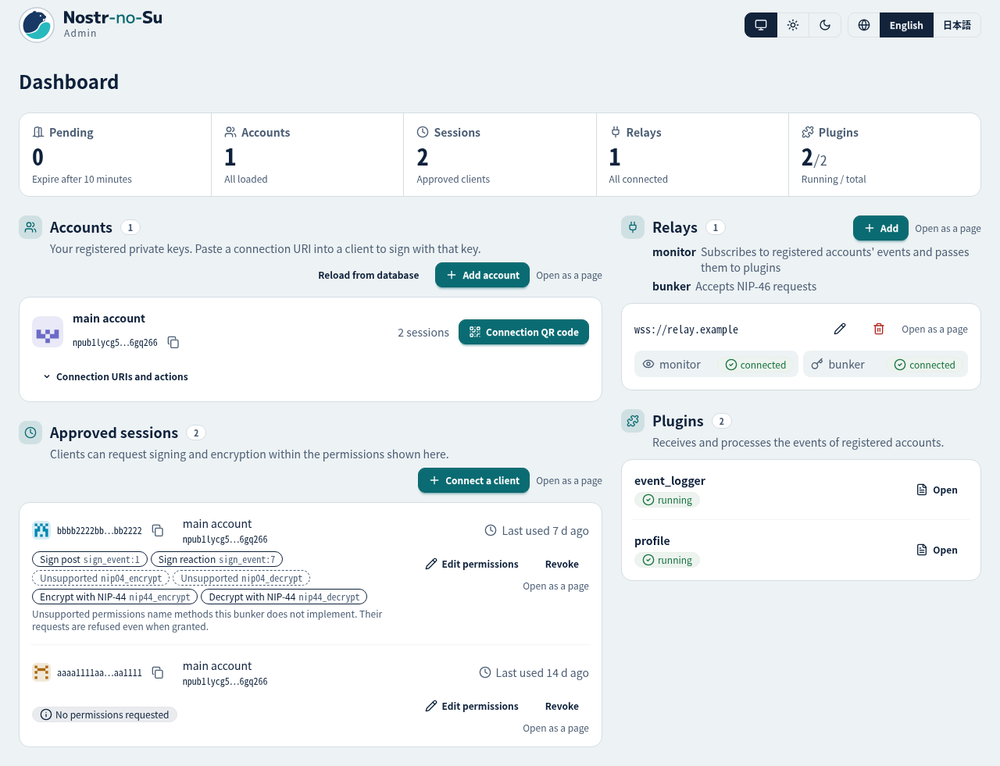
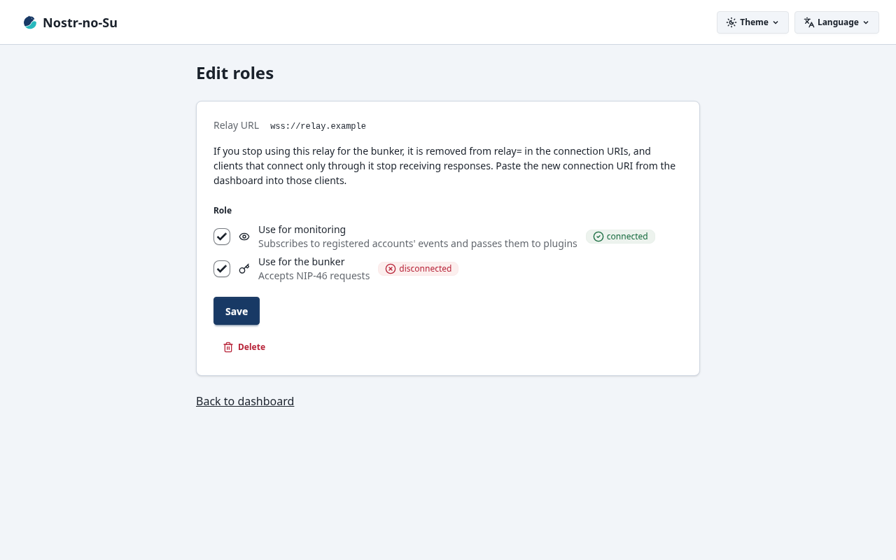
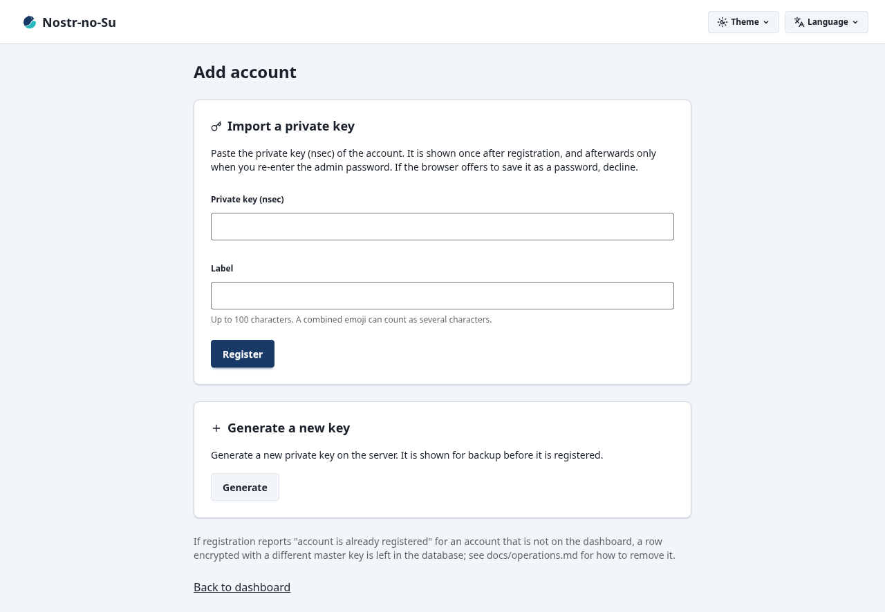
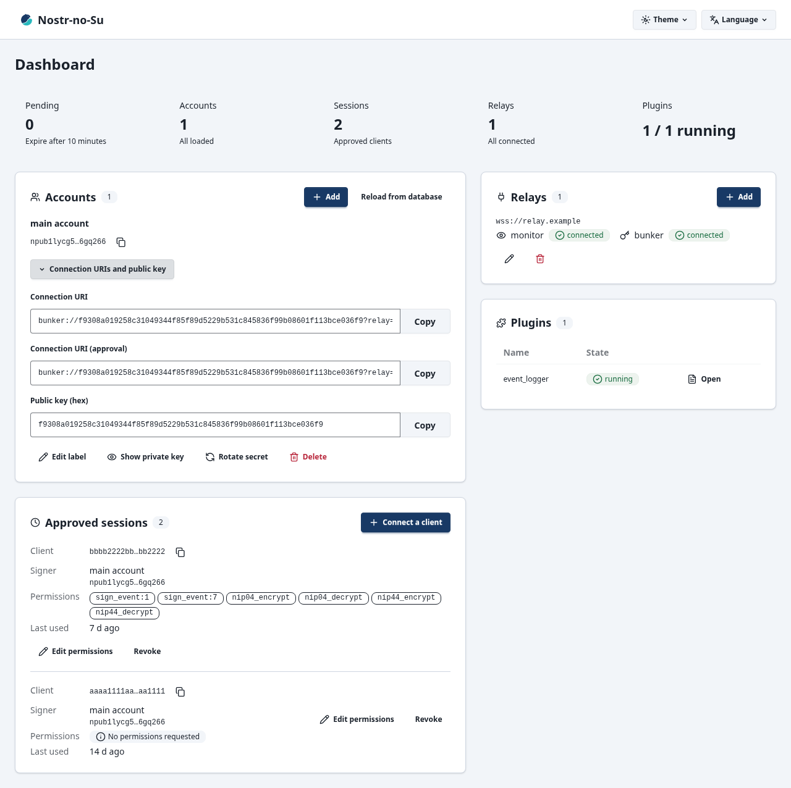
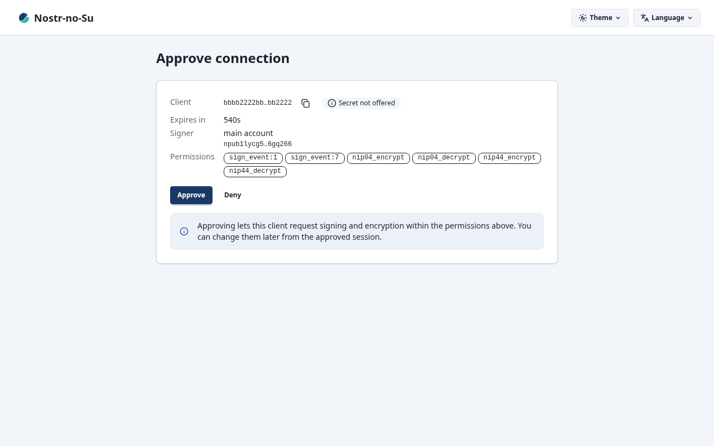
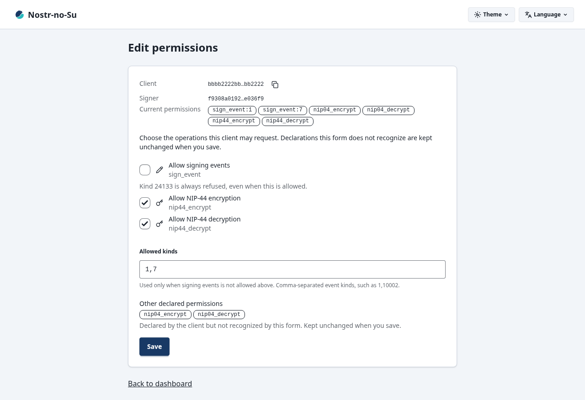
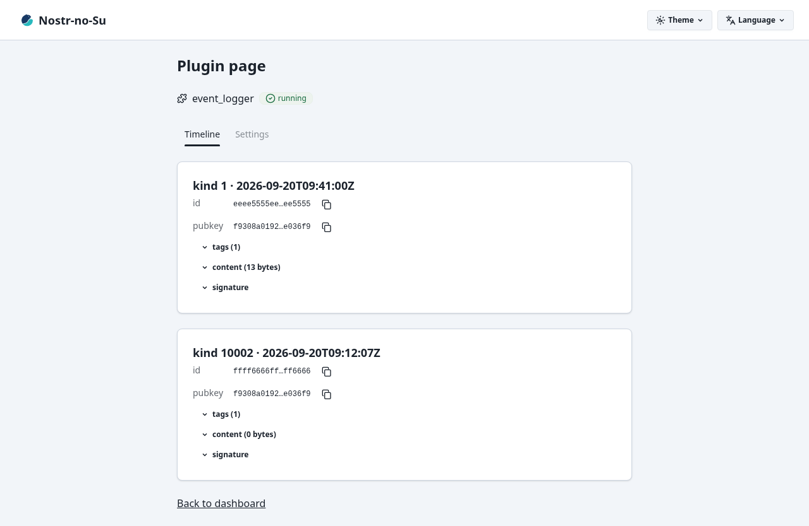
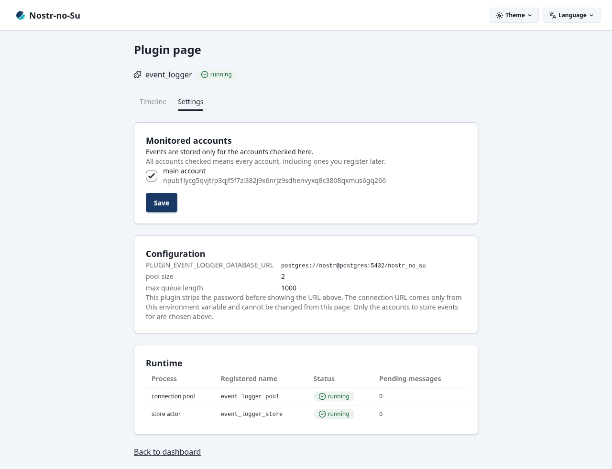

<p align="right">English | <a href="docs/readme-ja.md">日本語</a></p>

<p align="center">
  <picture>
    <source media="(prefers-color-scheme: dark)" srcset="assets/logo/nostr-no-su-color-dark.svg">
    
  </picture>
</p>

<h1 align="center">Nostr-no-Su</h1>

<p align="center">
  A NIP-46 remote signing bunker for Nostr, plus a utility server that processes your own events. Written in Gleam, running on the BEAM.
</p>

<p align="center">
  <a href="https://github.com/neverclear86/nostr-no-su/actions/workflows/ci.yml"></a>
  
  <a href="https://github.com/neverclear86/nostr-no-su/releases"></a>
  <a href="https://github.com/neverclear86/nostr-no-su/pkgs/container/nostr-no-su"></a>
  
  
  <a href="LICENSE"></a>
</p>

The server answers signing requests from clients connected over a `bunker://` URI (nsec.app, noStrudel, etc.) without ever handing them your private key. It also watches relays for events from your registered accounts and processes them with plugins (the bundled `event_logger` stores them in Postgres). It comes up together with Postgres via docker compose, and you operate keys and relays from the admin UI.

## ✨ Features

- **NIP-46 bunker**: Answers `connect` / `get_public_key` / `sign_event` / `ping` / `nip44_encrypt` / `nip44_decrypt` / `logout`. One instance holds the keys of multiple accounts and keeps dedicated connections to multiple relays (as long as any one of them is alive, it can sign). Clients without a secret connect through an approval in the admin UI (the `auth_url` flow)
- **Keys are stored encrypted**: Private keys and connection secrets are encrypted with the master key (`ACCOUNT_MASTER_KEY`) using AES-256-GCM and kept in Postgres. Signing and encryption are allowed only within the permissions declared in `connect` (perms, editable in the admin UI); clients that declare no perms are allowed signing—except for kind 24133—and NIP-44 encryption and decryption
- **Own crypto implementation**: BIP-340 Schnorr signatures and NIP-44 v2 encryption are implemented in Gleam and match the official test vectors. Primitives come from OTP's `crypto` (OpenSSL); no NIFs needed
- **Event monitoring and plugins**: Events of all registered accounts are collected from multiple relays, verified and deduplicated, then handed to plugins. Plugins run in dedicated processes and do not take the app down when they crash. Add your own plugin just by placing a BEAM module ([Plugin API v1](docs/plugin-api.md))
- **Admin UI**: A single screen covers account registration (entering an nsec or generating one on the server), connection URI display, connection approval, session permission editing and revocation, relay addition and role editing, and plugin status. Japanese and English, light and dark are supported, and no external files are loaded
- **Keeps running**: Under an OTP supervision tree, relay connections reconnect individually and automatically, the bunker keeps retrying even when the DB is down, and account additions and removals take effect without a restart

## 🚀 Getting started

You need docker (compose v2), `curl` to fetch files, and `openssl`, which `setup-env.sh` uses to generate keys. The published image `ghcr.io/neverclear86/nostr-no-su` contains both `linux/amd64` and `linux/arm64`, so the same steps work on an x86_64 server, a Raspberry Pi, or Apple Silicon.

### Run the published image

Cloning the repository is not needed. Fetch three files, create `.env`, and start. Replace `<version>` with a published release version (`X.Y.Z`; see [Releases](https://github.com/neverclear86/nostr-no-su/releases)).

```sh
mkdir nostr-no-su && cd nostr-no-su
base=https://raw.githubusercontent.com/neverclear86/nostr-no-su/v<version>
curl -fsSLO "$base/docker-compose.release.yml"
curl -fsSLO "$base/.env.example"
curl -fsSLO "$base/setup-env.sh"
mkdir -p plugins
sh setup-env.sh
docker compose -f docker-compose.release.yml up -d
```

`setup-env.sh` copies `.env.example` to `.env`, fills the two required values (the master key `ACCOUNT_MASTER_KEY` and the admin password `ADMIN_PASSWORD`) with generated ones, and sets `.env` to mode 600. `mkdir -p plugins` is where your own plugins go, and it may stay empty (compose mounts it, so if it is missing docker creates it owned by root). The image tag pulled is `latest`; to pin it to the version you fetched, write `NOSTR_NO_SU_VERSION=<version>` in `.env`. With this setup, `logs` and `exec` also need `-f docker-compose.release.yml` every time.

### Build from source

```sh
git clone https://github.com/neverclear86/nostr-no-su.git && cd nostr-no-su
sh setup-env.sh
docker compose up --build -d
```

### First run

1. Open `http://127.0.0.1:8080/` in a browser. The username is `admin`, and the password is the value of `ADMIN_PASSWORD` in `.env`.
   
2. From "Add" in the Relays section of the dashboard, register the relays the bunker will use (NIP-46-capable relays such as `wss://relay.nsec.app` are recommended) and the relays used for monitoring. The connections open without a restart.
   
3. From "Add" in the Accounts section, paste an nsec to register, or have the server generate a key. If you generate one, back up the nsec shown on the confirmation page before registering (afterwards it is only shown when you re-enter the admin password).
   
4. Open "Connection URIs and public key" on the account's row, copy the "Connection URI", and paste it into your client. Connecting with the "Connection URI (approval)", which carries no secret, goes through approval in the admin UI.
   
   
5. After a client connects, "Edit permissions" on its row in "Approved sessions" changes what it may request. Tick signing and NIP-44 encryption or decryption; to allow only some event kinds, leave signing unticked and list the kinds in "Allowed kinds". The change takes effect on the next request, and the client does not need to reconnect.
   
6. The bundled `event_logger` plugin adds two pages under Plugins. "Timeline" lists the events it has stored, and "Settings" chooses the accounts to store events for and shows the connection and the running processes.
   
   

Registered accounts accept connections without a restart. Secrets are stored encrypted too, so the connection URI does not change across restarts. The screen layout and the result of each operation are in [Admin UI](docs/admin-ui.md), and how to read the startup log is in the 「起動時のログ」 section of [Operations](docs/operations.md).

To run locally with `gleam run`, provide Postgres and pass `DATABASE_URL`, `ACCOUNT_MASTER_KEY`, and `ADMIN_PASSWORD` as environment variables ([Development](docs/development.md)).

## ⚙️ Configuration

All configuration is via environment variables, written to `.env` with docker compose. The only values that must go into `.env` are the master key and the admin password; everything else works with the defaults. Frequently changed ones are below; uncomment the corresponding lines in `.env.example` (remove the leading `# `) and edit them.

| Variable | Default | Purpose |
| --- | --- | --- |
| `ADMIN_PORT` | `8080` | Port of the admin UI. Leave it empty to disable the admin UI |
| `ADMIN_BASE_URL` | `http://localhost:<ADMIN_PORT>` | Base URL of the approval page. Use the public URL when serving through a reverse proxy |
| `POSTGRES_USER` / `POSTGRES_PASSWORD` / `POSTGRES_DB` | `nostr` / `nostr` / `nostr_no_su` | Credentials of the bundled Postgres. They only take effect while the `postgres-data` volume is empty; changing them after the first start makes the app's connection fail |

The full table of variables, how to pass secrets via files (`<variable>_FILE`), reverse proxy placement, and the container setup (read-only root, `/tmp`, remsh, logging) are in [Configuration](docs/configuration.md).

## 🔐 Security

- **Losing the master key loses the keys**: If you lose `ACCOUNT_MASTER_KEY`, the private keys of all stored accounts can no longer be decrypted (the DB alone cannot restore them). Conversely, a DB dump together with the master key leaks the private keys of every account. Keep the master key somewhere separate from backups and out of version control (the 「マスターキーの保管」 section of [Operations](docs/operations.md); the rotation procedure is in 「マスターキーの交換」 in the same document).
- **The admin UI is plain HTTP**: Both the Basic-auth credentials and the `bunker://` URIs containing a secret—signing authority itself—flow unencrypted. The bundled compose publishes only to the host's loopback (`127.0.0.1:8080`). When using it from outside, put a TLS-terminating reverse proxy in front (the 「リバースプロキシーの設定」 section of [Configuration](docs/configuration.md)). There is no limit on authentication attempts, so use a hard-to-guess password.
- **Plugins run with the same privileges as the app**: BEAM modules placed in `PLUGIN_DIR` run in the same VM as the app and can reach the processes holding private keys. There is no sandbox. Place only ones you trust, and read the source of any plugin received from a third party before placing it.
- **Revealing and deleting private keys**: Revealing a private key in the admin UI leaves `[admin] revealed the private key of <npub>` in the log. Deleting an account removes the key from the DB as well, and keys not stored elsewhere cannot be recovered. Copied nsecs and connection URIs remain in the clipboard, so clear it after pasting.
- **`REMSH_ENABLED=true` only when in use**: Anyone who can exec into the container can reach everything in the VM, including decrypted private keys. It is disabled by default; enable it only while you use it.

The security assumptions in v0.1 and the items deliberately not mitigated are in the 「v0.1 のセキュリティの前提」 section of [Design decisions and known limitations](docs/design-decisions.md).

## 🔄 Updating and backing up

Data lives in the compose `postgres-data` volume and is not lost when the image is replaced. DB schema migrations run automatically at startup (there are no backward migrations). Take a dump before upgrading. In a build-from-source setup, drop `-f docker-compose.release.yml` and add `--build` to `up -d` (read `pull` as `git pull`).

```sh
docker compose -f docker-compose.release.yml exec -T postgres pg_dump -U nostr -d nostr_no_su -Fc > nostr-no-su-$(date +%Y%m%d).dump
docker compose -f docker-compose.release.yml pull
docker compose -f docker-compose.release.yml up -d
```

Re-fetching files when a new version changes `docker-compose.release.yml` or `.env.example`, how volume names are determined, and restoring from a dump with the post-restore checks are in [Operations](docs/operations.md). Changes for each version are recorded in the [Changelog](CHANGELOG.md).

## 🧩 Plugins

The bundled `event_logger` stores the events received by the monitor into the `events` table in Postgres (all NIP-01 fields, `tags` as jsonb, and the ingestion time; the same event received from multiple relays still becomes one row). It works as-is in the default compose setup; the latest 20 stored events are shown at `/plugins/event_logger/timeline` in the admin UI, and the storage status at `/plugins/event_logger/settings`. The accounts to store can be selected at `/plugins/event_logger/settings` (default: all accounts). The source and how to build a modified version are in [`plugins-src/event_logger/`](plugins-src/event_logger/README.md).

To write your own plugin, write a module in Erlang or Gleam that exports `plugin_api_version/0`, `plugin_name/0`, and `handle_event/1` or `handle_event/2` (the form that receives the config; either is fine), and place it in `./plugins`. The spec is [Plugin API v1](docs/plugin-api.md), and examples are in [`examples/plugins/`](examples/plugins/) (the stateless `file_logger` and the stateful `counter`).

## 🪺 Why “Nostr-no-Su”?

“Nostr no su” means “Nostr’s nest” in Japanese—a home for your keys and events.

There’s also a little wordplay: No Secret Uploads—your Nostr clients request signatures, not your private key.

## 📚 Documentation

The documents below are written in Japanese.

- [Configuration](docs/configuration.md): environment variable table, `.env`, passing secrets via files, reverse proxy, docker compose setup
- [Operations](docs/operations.md): startup logs, backups, version upgrades, recovery, storing and rotating the master key
- [Admin UI](docs/admin-ui.md): screen layout, account operations and results, connection approval (the auth_url flow)
- [Plugin API v1](docs/plugin-api.md): the spec for writing plugins
- [Design decisions and known limitations](docs/design-decisions.md): the decisions that shaped the app and their reasons, and the remaining limitations
- [Architecture](docs/architecture.md): processes, the paths of events and requests, directory structure, configuration readers
- [Development](docs/development.md): running and testing locally, testing conventions, building the admin UI's CSS and taking screenshots
- [Contributing](CONTRIBUTING.md): how to submit changes, versioning policy, release procedure
- [Changelog](CHANGELOG.md): changes per release

## 🛠 Contributing

Developed on Gleam 1.17.0 / OTP 29. Running and testing locally and the CI checks are in [Development](docs/development.md) and [Contributing](CONTRIBUTING.md). Issues and PRs are welcome.

## License

This repository is licensed under the [MIT License](LICENSE).
`vendor/stratus/` is a modified copy of stratus, licensed under the Apache License 2.0; attribution is in [NOTICE](NOTICE) and the modifications are recorded in [vendor/stratus/PATCH.md](vendor/stratus/PATCH.md).
The icons of the admin UI, except the product logo in the top bar and the favicon, are traced from [Lucide](https://lucide.dev) strokes under the ISC license; attribution is in [NOTICE](NOTICE). The logo belongs to this repository and follows the [MIT License](LICENSE).
