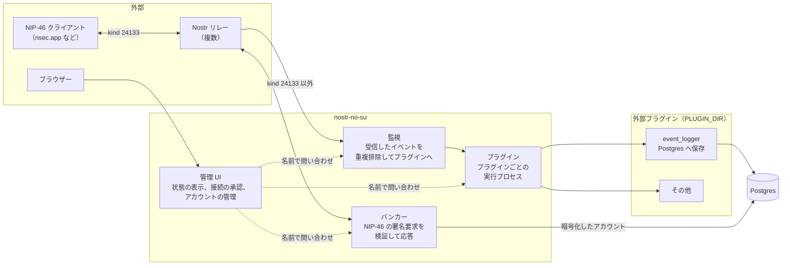
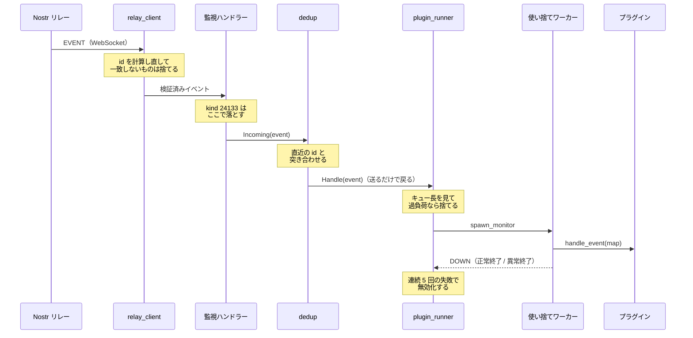
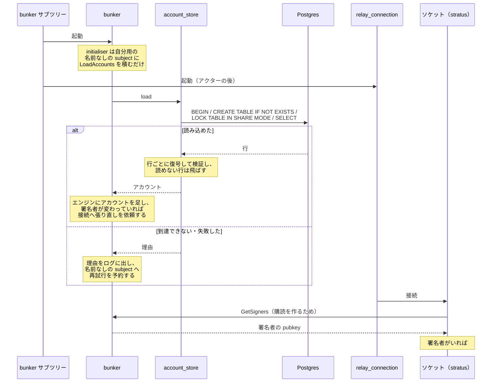
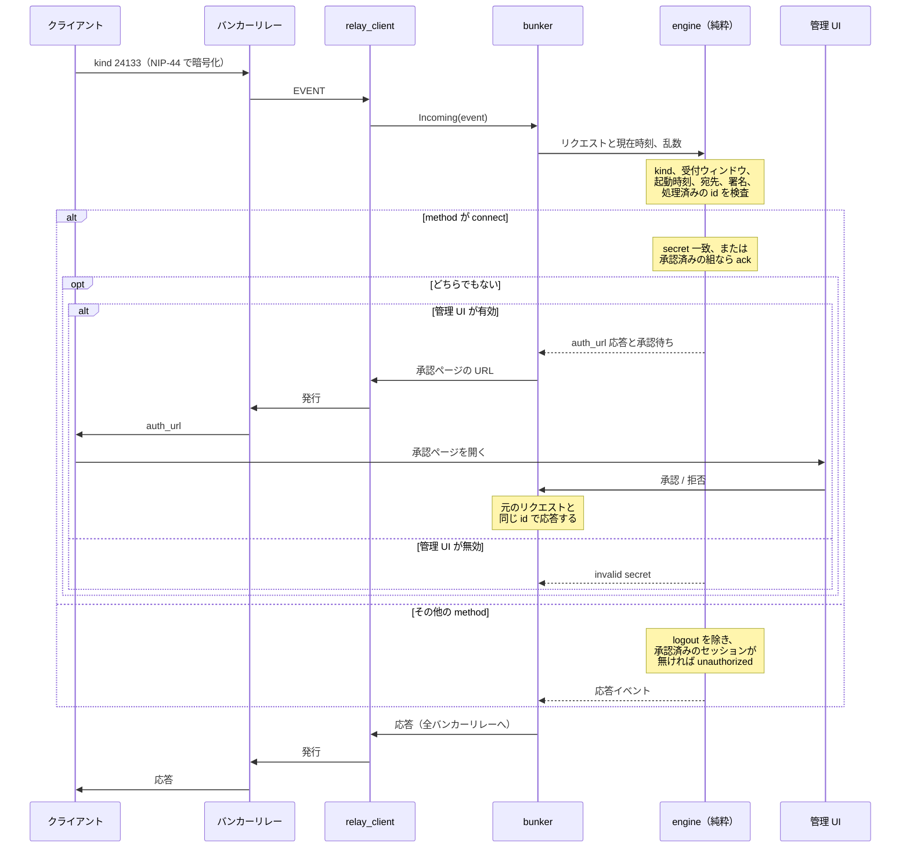
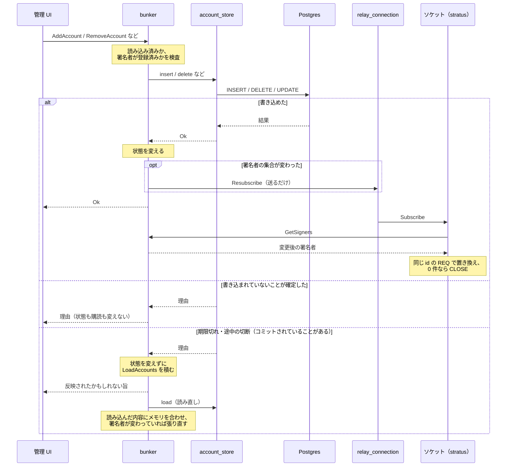
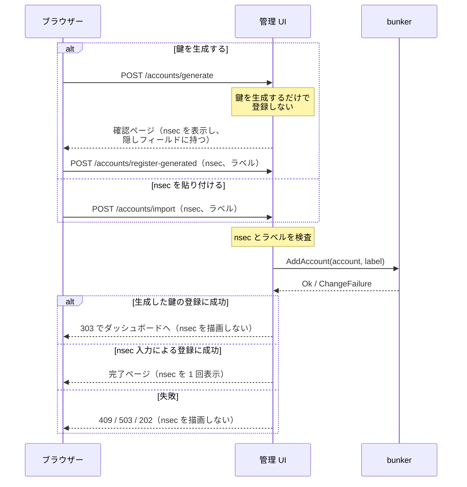
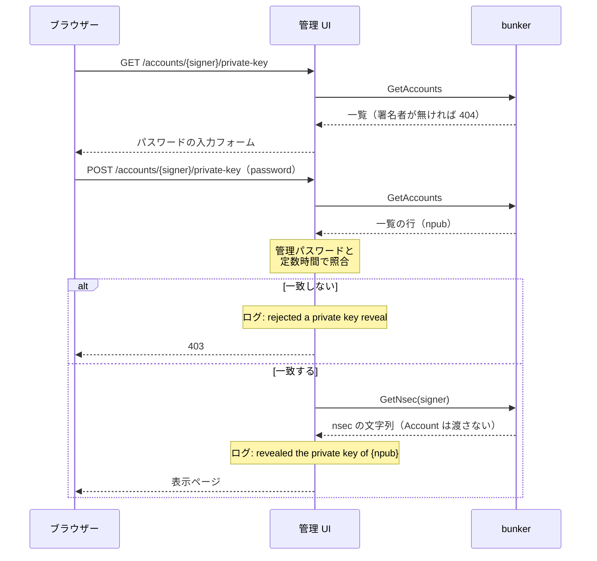
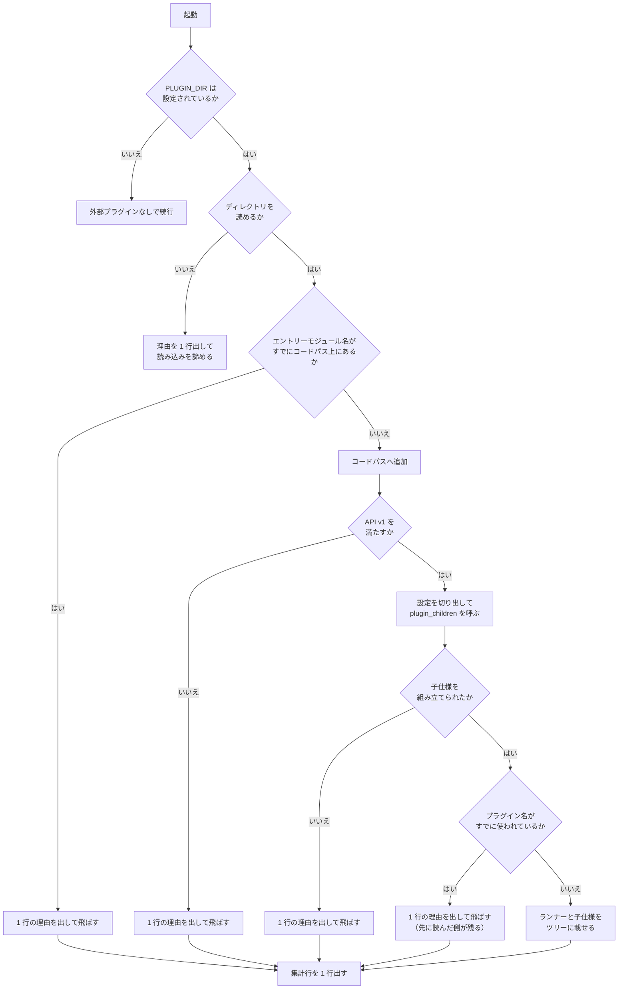

# システム構成

この文書は、nostr-no-su が何をどう組み立てて動いているかを示す。
読み手として想定するのは、この本体のコードに手を入れる開発者である。
プラグインを書くだけなら [プラグイン API v1 の仕様](plugin-api.md) を読めばよく、この文書は要らない。

扱うのは、プロセスの構造、イベントとリクエストが通る経路、プラグインの読み込み、ディレクトリの配置、設定の読み手である。
判断の理由は、その判断が他の部分の形を決めている場合にだけ添える。
それ以外の理由は各モジュールの doc コメントにあるので、そちらへ譲る。

## 全体像

本体は 4 つの独立した部分からなる。



監視とバンカーはリレーへの接続を共有しない。
`relay.nsec.app` のように kind 24133 以外の購読を拒否するリレーをバンカー専用に使えるようにするためで、`RELAY_URL` と `BUNKER_RELAY_URL` は別々に設定する。

管理 UI は他のどの部分にも依存しない。
表示する状態は名前付きアクターへの問い合わせで取るので、UI が再起動しても問い合わせ先が再起動しても、配線をやり直す必要がない。
問い合わせが失敗したときはその項目だけを「unavailable」として描画し、ページ全体は失敗させない。
問い合わせの返信先は OTP の `gen_server:call` と同じく monitor の alias なので、タイムアウトの後に届いた応答（接続 secret を含みうる）はランタイムが捨て、UI のハンドラーのメールボックスにもログにも残らない。

## スーパービジョンツリー

常駐するプロセスはすべて `static_supervisor` の下に置く。
ツリーは起動時に 1 度だけ組み、実行中に子を足すことはしない。

ツリーの外で動くプロセスが 2 種類ある。
プラグインのイベント処理を動かす使い捨てワーカーと、`relay_connection` が所有する WebSocket のソケットプロセスである。
前者は監視だけを張り、後者はリンクを張ったうえで exit を trap する。
どちらも所有者が死を検知するので、スーパーバイザーの再起動許容回数を消費しない。

```
root (one_for_one, 3/60)
├── plugins      (one_for_one, 5/10)   プラグインごとのランナー
│   ├── children(<plugin>) (one_for_one, 5/10, Temporary)  子仕様を持つプラグインだけ
│   │   └── <プラグインが申告した子プロセス>
│   └── runner(<plugin>)   (worker, Permanent)
├── monitor      (rest_for_one, 5/10)  重複排除ディスパッチャー、次にリレーごとの接続
│   ├── dedup
│   └── relay_connection × 監視リレーの数
├── bunker       (rest_for_one, 5/10)  DATABASE_URL と ACCOUNT_MASTER_KEY が揃ったときだけ
│   ├── account_pool   (pog, supervisor)  アカウントストアの接続プール
│   ├── bunker
│   └── relay_connection × バンカーリレーの数
└── admin        (mist)                管理 UI の HTTP サーバー
```

監視とバンカーのサブツリーが `rest_for_one` なのは、先頭のアクターが再起動したときに後続の接続もまとめて落とすためである。
接続は復帰の過程で購読を張り直し publisher を登録し直すので、再起動したアクターが再び生きたソケットに配線される。
一方、アカウントの変更ではバンカーアクターを再起動しない（再起動するとインメモリのセッションが消える）。
署名者の集合が変わったら、アクターは接続アクターを名前で呼んで購読の張り直しを依頼し、接続アクターが生きたソケットに購読を合わせ直させる（「アカウントの変更」の節）。

バンカーのサブツリーだけは、アクターの前に接続プールを置く。
pgo はチェックアウト先のプール名が未登録だと、呼び出し側のプロセスを `noproc` で exit させる。
プールを先頭に置けば、アクターはプールの登録後にしか起動せず、プールが落ちればアクターも止められてから起動し直すので、未登録のプールを叩く状況が構造上生じない。
DB の停止や再起動ではプールのプロセスは死なない（pgo が再接続を内部で扱い、クエリーは値で失敗する）ので、プールの再起動に伴ってアクターのセッションが消えるのは、プール自体のバグか外部からの kill のときに限られる。

`plugins` サブツリーがルート直下にあってプラグインのランナーが `one_for_one` で並ぶのは、プラグイン同士が独立で、監視が無効な構成でも状態を見せたいからである。
ルートの子は `plugins` を `monitor` より先に追加する。
逆順だとディスパッチャーが未登録のランナー名へ送り、起動直後のイベントを取りこぼす。

### 再起動の許容回数に頼らない設計

ルートの `restart_tolerance(3, 60)` は、復旧できないサブツリーを抱えたままループするより、プロセスごと終了してコンテナーの再起動ポリシーに委ねるための設定である。

毎イベントでクラッシュするプラグインに対して、有限の再起動許容回数は原理的に成立しない。
どんな値を設定しても、秒間数十件のイベントが来ればサブツリーは許容回数を使い切り、ルートもやがてアプリを終了させる。
そこで、プラグインの不調でそもそもプロセスが死なないようにしている。

- プラグインのイベント処理関数は、イベント 1 件ごとの使い捨てプロセスで動かす。
  ランナーはそのワーカーとリンクを張らず監視だけを張るので、例外も異常終了もランナーには伝播しない。
- プラグインが申告した子プロセスは普通にクラッシュループしうるので、プラグイン 1 つぶんの子を専用のスーパーバイザーにまとめ、その子仕様を `Temporary` にする。
  子スーパーバイザーが許容回数を使い切って終了しても、親はそれを再起動せず、自分の許容回数も減らさない。

親の許容回数が減らないのは、`Temporary` だからではない。
そのとき子は理由 `shutdown` で終了し、親では理由ベースの分岐に当たって再起動の記録そのものが行われないからで、これは `Transient` でも同じである。
`Temporary` を選ぶ理由は別にあって、諦めた子の仕様が親から削除されること（`Transient` は死んだまま一覧に残る）と、許容回数超過以外の理由で落ちたときに再起動されないことの 2 つである。

詳しくは `src/nostr_no_su/app.gleam` と `src/nostr_no_su/plugin_runner.gleam` の doc コメントに、OTP のどの節がそう振る舞うかの出典つきで書いてある。

DB の障害も同じ考え方で、プロセスの死にしない。
DB の停止はプールのプロセスを殺さず、バンカーアクターはストアの失敗で落ちずに再試行を予約するだけで、起動時にも DB を待たない（次節）。
したがって DB が落ちていてもルートの許容回数は消費されず、兄弟の監視とプラグインは動き続ける。

## イベントが流れる経路

監視リレーから届いたイベントがプラグインに渡るまでを追う。



`relay_connection` はこの経路には現れない。
ソケットを所有して切断を検知し再接続を予約するのがその役目で、イベントそのものは `relay_client` がハンドラーへ直接渡す。
不安定なリレーがスーパーバイザーの再起動許容回数を消費しないよう、接続が死んでも道連れにならない作りにしてある。

遅いプラグインが他のプラグインへの配信を止めないのは、ディスパッチャーがランナーへ送った時点で戻り、プラグインの実行時間がそこに載らないからである。

重複排除は有界なスライディングウィンドウで行う。
複数のリレーが同じイベントを配信し、再接続のたびに保存済みイベントが再送されるため、同じ id を 2 度プラグインへ渡さないようにしている。
ウィンドウは有限なので、配信は at-least-once であって exactly-once ではない。

プラグインが受け取るのは Gleam のレコードではなく binary キーの Erlang map である。
レコードはランタイムではタプルなので、フィールドを 1 つ足すだけで既存のプラグインが黙って壊れる。
map なら Erlang や Elixir で書いたプラグインも載せられる。

## アカウントの読み込み

バンカーアクターは起動したあとで、アカウントを Postgres から読み込む。



`LoadAccounts` は initialiser が積むのでアクターのメールボックスの先頭になり、接続はアクターの後に起動するので、`GetSigners` は必ず読み込みの後に処理される。
DB が起動時に到達可能なら、どの接続も読み込み済みの署名者で購読する。

再試行を名前なしの subject へ予約するのは、名前付き subject へのタイマーが名前宛てになり、再起動した後の同じ名前のアクターに届いて再試行が重複するためである。
名前なしの subject は pid 宛てなので、アクターが終了するとランタイムがタイマーを取り消す。

DB が起動時に到達できなかった場合も、読み込みが後から成功した時点で署名者の集合が変わるので、アクターは再接続を待たずに購読の張り直しを依頼する（次節の図と同じ経路）。
DB に到達できる通常の起動でも、1 件以上を読み込めば同じ依頼が出るので、接続ごとに同じ内容の REQ が 1 回余計に送られうる。
同じ id の REQ は置き換えなので害は無く、規則を「署名者の集合が変わったら張り直す」の 1 つに保つほうを選んでいる。

## NIP-46 リクエストが流れる経路

クライアントからの署名要求は、監視とは別の接続で受ける。



判断はすべて `engine` に置いてある。
アクターが持つのはセッション状態と、乱数や現在時刻のような外界からの入力だけである。
リレークライアントは切断のたびに再起動されるため、セッション状態をそこに置けない。

応答はどのリレーから来たリクエストでも全バンカーリレーへ発行する。
クライアントは `bunker://` URI の `relay=` をすべて聴くので、リレーが 1 つ生きていれば往復が成立する。

## アカウントの変更

アカウントの追加・削除・secret の作り直し・ラベルの差し替えは、バンカーアクターを再起動せずに反映する。



書き込みはアクターの中で行い、成功したときだけ状態を変える。
書き込みが期限を過ぎたときや途中で接続が切れたときは、サーバー側でコミットされていることがあるので、メモリを変えずに読み直して合わせる。
合わせる処理はエンジンを作り直さず、ストアに無い署名者を取り除いて読み込んだアカウントを足すので、残った署名者のセッションは消えない。
読み直しに失敗したら起動時の読み込みと同じく名前なしの subject へ再試行を予約し、成功するまでの間は変更を拒否する。
読み込みは 1 本のトランザクションで `LOCK TABLE bunker_accounts IN SHARE MODE` を取ってから一覧を読む。
SHARE は実行中の書き込みが持つ ROW EXCLUSIVE と衝突するので、期限を過ぎた後もサーバー側で実行を続けている書き込みがあれば、その終了を待ってから読む。
メモリは成功した書き込みと成功した読み込みの結果だけで変わり、結果が曖昧な書き込みの後は、読み直しに成功した時点でその書き込みの結果を含めて DB と一致する。
例外として、期限の直前に送った文がサーバーに届いてロックを取るより先に読み直しがロックを取ると、その書き込みは読み直しに見えない（ローカルの測定では、コミットされた期限切れの挿入 704 件で 0 件）。
読み直しが失敗し続ける間は、5 秒ごとの再試行のたびに読み込みの期限（3 秒）まで NIP-46 の処理が待たされる。
書き込みの間に届いた NIP-46 のリクエストはメールボックスに積まれ、書き込みの後に処理される。

張り直しの依頼を接続アクター経由にしているのは、再接続との競合を閉じるためである。
接続アクターはメッセージを逐次に処理するので、接続の途中に届いた依頼は新しいソケットを保持した後に転送され、再接続を待っている間の依頼は次の接続が購読を評価し直すことで満たされる。
いずれの場合も、ソケットが送る `GetSigners` は変更の処理が返った後にアクターへ届くので、最後に送られる REQ は変更後の署名者から作られる。

ソケットは購読の定義を「開いている購読 id」と照合する（`relay_client.sync`）。
`GetSigners` に応答が無いときは定義を得られなかったものとして、開いている購読を変えずに再試行を 1 つだけ予約する。
応答が無いことを署名者 0 件と区別しないと、アクターが遅い書き込みで詰まっている間に、全署名者の購読を CLOSE してしまうからである。

管理 UI は、変更の結果を型 `bunker.ChangeFailure` で受け取り、状態コードに写す。
文言は本文に出すだけで、分岐には使わない。

| 結果 | アクターのどの分岐から来るか | 管理 UI の応答 |
| --- | --- | --- |
| `Ok(Nil)` | 書き込めた | 303 でダッシュボードへ（nsec 入力による登録は 200 の完了ページ） |
| `NotApplied` | 登録済み・未登録の検査（`require_unregistered` / `require_registered`）、`NotWritten`、`AlreadyStored` | 409 でフォームに理由を出す |
| `NotReady` | 読み込みか読み直しの前（`Loading`）、バンカーが無効 | 503 の通知ページ |
| `MaybeApplied` | `MaybeWritten`、変更の問い合わせのタイムアウト | 202 の通知ページ |

`MaybeApplied` を 409 にしないのは、反映されたかもしれない変更を「拒否された」と見せると、利用者が同じ変更をやり直し、secret の作り直しならもう一度作り直してしまうからである。
アカウント 1 件の操作は変更の前に一覧を引くので、一覧に無い署名者（削除済みの署名者への再送など）はバンカーに届く前に 404 になる。
`require_registered` の拒否（409）が届くのは、管理 UI が一覧を引いてからバンカーが変更を処理するまでの間に削除された場合（同時に送られた削除など）だけである。利用者がダッシュボードを開いた後に削除されたアカウントは、操作の時点で一覧に無いので 404 になる。
`NotReady` を `NotApplied` と分けるのは、時間をおけば同じ変更を受け付けうる一時的な状態だからで、一覧を得られないときの 503 と揃えている。

## アカウントの登録と秘密鍵の再表示

管理 UI は秘密鍵をサーバーに保持しない。
鍵はブラウザーとの間を POST の本文とその応答の本文だけで往復し、クエリー文字列にもリダイレクト先にも載らない。
書き込み、状態の変更、購読の張り直し、結果が曖昧なときの読み直しは、前節の「アカウントの変更」と同じ経路を通る。



生成と登録を分けるのは、確認ページの再読み込みで POST が再送されても何も登録されないようにするためである。
1 回の POST で生成と登録を行うと、再送のたびに別の鍵のアカウントが登録される。
生成した鍵の登録でラベルだけが規則に反したときは、送られた nsec の確認ページを理由付きで返し、生成した鍵を失わないようにする（nsec が不正なら登録画面に戻す）。



`GetNsec` の応答が `Account` ではなく nsec の文字列なのは、管理 UI のプロセスが署名や復号に使える値を持たないようにするためである。
要求は公開鍵と返信先しか持たず、応答は alias の問い合わせで受けるので、タイムアウトの後に届いた nsec はランタイムが捨てる。
アクターは読み込みか読み直しの前（`Loading`）には答えない。
ログに出すのは一覧の行の npub だけで、パスワードも nsec も出さない。

## 管理 UI のルート

`/healthz` 以外はすべて Basic 認証を要する。
状態を変えるルートはすべて POST で、`Origin` / `Referer` と `Host` を突き合わせる CSRF の検査の下にある。
認証済みの応答にはすべて `cache-control: no-store` と、枠への埋め込みを禁じるヘッダーを付ける。
パスの定義は `admin/dashboard.gleam` にだけ置き、ルーティングとフォームの `action` が同じ定義を見る。

| メソッド | パス | 役割 |
| --- | --- | --- |
| GET | `/healthz` | 認証なしで `ok` を返す |
| GET | `/` | ダッシュボード |
| GET / POST | `/approve/<token>` | 承認ページ / 承認 |
| POST | `/deny/<token>` | 拒否 |
| POST | `/sessions/revoke` | セッションの取り消し |
| GET | `/accounts/new` | 登録画面（nsec の入力と鍵の生成） |
| POST | `/accounts/generate` | 鍵を生成して確認ページを返す（登録しない） |
| POST | `/accounts/import` | nsec 入力による登録。完了ページで nsec を 1 回表示する |
| POST | `/accounts/register-generated` | 生成した鍵の登録。303 でダッシュボードへ戻す |
| GET / POST | `/accounts/<signer>/label` | ラベルの編集フォーム / 差し替え |
| GET / POST | `/accounts/<signer>/rotate` | secret の作り直しの確認 / 実行 |
| GET / POST | `/accounts/<signer>/delete` | 削除の確認 / 実行 |
| GET / POST | `/accounts/<signer>/private-key` | パスワードの入力フォーム / 秘密鍵の表示 |

`<signer>` は署名者の x-only 公開鍵の小文字 16 進である。
アカウント 1 件の操作は GET でも POST でも先にバンカーの一覧を引き、一覧に無い署名者は 404 にする。
以降のログとバンカーへの呼び出しには、パスの値ではなく一覧の行の値を使う。

## プラグインが読み込まれるまで

起動時に `PLUGIN_DIR` を 1 度だけ走査する。



読み込みの失敗で起動は止まらない。
弾かれるのは 1 つのプラグインだけで、監視もバンカーも他のプラグインも影響を受けない。
`PLUGIN_DIR` 自体が読めないときだけは走査に入れないので、集計行も出ない。

設定は `PLUGIN_<NAME>_<KEY>` の環境変数を集め、プラグイン名が確定した時点で接頭辞に一致するものだけを切り出して渡す。
設定が足りないときは、プラグインの `plugin_children/0` または `/1` が `{error, Reason}` を返して読み込みを拒否できる。
値の妥当性（接続文字列として解釈できるか、など）は本体には判断できないので、そこをプラグインに委ねている。

読み込んだ BEAM は本体と同じ VM で同じ権限で動く。
サンドボックスは無く、秘密鍵を持つアクターの状態にも到達できる。
信頼できるものだけを置くこと（[プラグイン API v1](plugin-api.md) の第 1 章）。

## ディレクトリ構造

```
nostr-no-su/
├── src/                          本体
│   ├── nostr_no_su.gleam         エントリポイント（設定の読み込みとツリー仕様の組み立て）
│   ├── nostr_no_su_ffi.erl       OTP への FFI（crypto / code / file / process）
│   └── nostr_no_su/
│       ├── app.gleam             スーパービジョンツリーの構成
│       ├── config.gleam          環境変数からの設定読み込み
│       ├── admin.gleam           管理 UI の HTTP サーバーとルーティング
│       ├── admin/dashboard.gleam ダッシュボードとアカウントのページの描画（純粋関数）とパスの定義
│       ├── dedup.gleam           リレー横断の重複排除ディスパッチャー
│       ├── dedup/window.gleam    直近のイベント id のスライディングウィンドウ（純粋）
│       ├── plugin.gleam          プラグイン API v1 の検証と読み込み
│       ├── plugin_children.gleam 子仕様の検証と ChildSpecification への変換
│       ├── plugin_config.gleam   プラグイン固有の設定の切り出し
│       ├── plugin_loader.gleam   PLUGIN_DIR の走査とコードパスへの追加
│       ├── plugin_runner.gleam   プラグイン 1 つぶんの実行プロセス
│       ├── plugins/
│       │   └── console_logger.gleam  内蔵プラグイン（受信を 1 行出す）
│       ├── bunker.gleam          バンカーのアクター（セッション状態を保持）
│       ├── bunker/engine.gleam   NIP-46 リクエスト処理の純粋コア
│       ├── bunker/rpc.gleam      JSON-RPC コーデック
│       ├── bunker/account.gleam  鍵材料と bunker:// URI
│       ├── bunker/vault.gleam    マスターキーと、アカウントの暗号化形式・行の検証（純粋）
│       ├── bunker/account_store.gleam アカウントを Postgres に保存するストア
│       ├── nostr/event.gleam     Event 型・コーデック・ID 計算・署名
│       ├── nostr/filter.gleam    購読フィルター
│       ├── nostr/message.gleam   クライアントとリレーのメッセージ
│       ├── nostr/nip19.gleam     NIP-19 の npub / nsec の符号化と復号
│       ├── relay_client.gleam    WebSocket クライアント（stratus）
│       ├── relay_connection.gleam リレー 1 本ぶんの接続を保つアクター
│       ├── crypto/secp256k1.gleam 点演算・鍵導出・ECDH
│       ├── crypto/bip340.gleam   BIP-340 Schnorr 署名と検証
│       ├── crypto/nip44.gleam    NIP-44 v2 暗号化
│       ├── crypto/aes_gcm.gleam  AES-256-GCM の箱（nonce、暗号文、タグ）
│       ├── hex.gleam             16 進文字列とバイト列の相互変換
│       ├── log.gleam             ログ 1 行の組み立て
│       ├── named.gleam           名前付きアクターへの安全な送信と問い合わせ
│       ├── random.gleam          推測されては困る値のための乱数
│       └── time.gleam            現在時刻（FFI）
│
├── test/                         本体のテスト（gleeunit）
│   └── support/                  テスト用の fixture
│
├── plugins-src/                  同梱プラグインのソース
│   └── event_logger/             Postgres へ保存する（独自の依存と設定を持つ）
│       ├── gleam.toml            本体とは独立した Gleam プロジェクト
│       ├── manifest.toml         共有パッケージの版を本体に合わせて固定する
│       ├── src/
│       │   ├── event_logger.gleam       API v1 の関数と起動シム
│       │   ├── event_logger/store.gleam 保存アクターとスキーマ
│       │   └── event_logger_ffi.erl     子仕様 map の組み立て
│       └── test/
│
├── examples/plugins/             プラグインの書き方の例
│   ├── file_logger/              状態を持たず、設定を受け取る（Erlang 1 ファイル）
│   └── counter/                  子プロセスを申告する（Erlang 1 ファイル）
│
├── plugins/                      ビルド済みプラグインの置き場所（追跡しない）
│
├── docs/
│   ├── plugin-api.md             プラグイン API v1 の仕様（プラグイン作者向け）
│   └── architecture.md           この文書
│
├── vendor/stratus/               パッチ済み stratus（README を参照）
├── gleam.toml
├── Dockerfile
└── docker-compose.yml
```

`src/` と `plugins-src/` は別々の Gleam プロジェクトである。
本体はバンカーのアカウントストアのために `pog` に依存し、`event_logger` もイベント保存のために `pog` を同梱する。
同じ名前のモジュールは本体の版が優先される（プラグイン側は影に入る）ので、共有するパッケージの版は両方の `manifest.toml` で揃え、CI で一致を検査している。

`plugins/` は追跡しない。
`plugins-src/` や `examples/` のソースを本体と同じ docker イメージの中でビルドし、その成果物をここへ置く。
ホスト環境でビルドすると同梱物が変わってしまうので、ビルド手順は各プラグインの README に従う。

## 環境変数と読み手

環境変数はすべて `config.gleam` の 1 か所で読む。

| 変数 | 読み手 | 未設定のとき |
| --- | --- | --- |
| `RELAY_URL` | 監視 | `wss://relay.damus.io` を使う |
| `BUNKER_RELAY_URL` | バンカー | `RELAY_URL` と同じリレーを使う |
| `PUBKEYS` | 監視 | 直近のイベントを購読する |
| `DATABASE_URL` | バンカー（アカウントストア） | バンカーを無効にする |
| `ACCOUNT_MASTER_KEY` | バンカー（アカウントの暗号化） | バンカーを無効にする |
| `PLUGIN_DIR` | プラグインローダー | 外部プラグインを読み込まない |
| `PLUGIN_<NAME>_<KEY>` | 各プラグイン | プラグインが判断する |
| `ADMIN_PORT` | 管理 UI | `8080` で待ち受ける |
| `ADMIN_BIND` | 管理 UI | `127.0.0.1` で待ち受ける |
| `ADMIN_PASSWORD` | 管理 UI | 起動ごとに乱数で生成する |
| `ADMIN_BASE_URL` | バンカー（承認ページの URL） | `http://localhost:<ADMIN_PORT>` を使う |

プラグイン固有の設定だけは本体が中身を解釈しない。
接頭辞に一致する変数を集めて map で渡すだけで、キーの必須性も値の形式もプラグインが決める。

## 関連文書

- [プラグイン API v1 の仕様](plugin-api.md)：プラグインを書く人向け。必須エクスポート、イベント map、実行モデル、設定、配置と読み込み
- [README](../README.md)：使い方、環境変数の詳細、設計上の判断と既知の制約
- `plugins-src/event_logger/README.md`：同梱プラグインのビルドと配置
