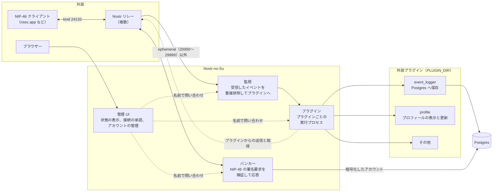
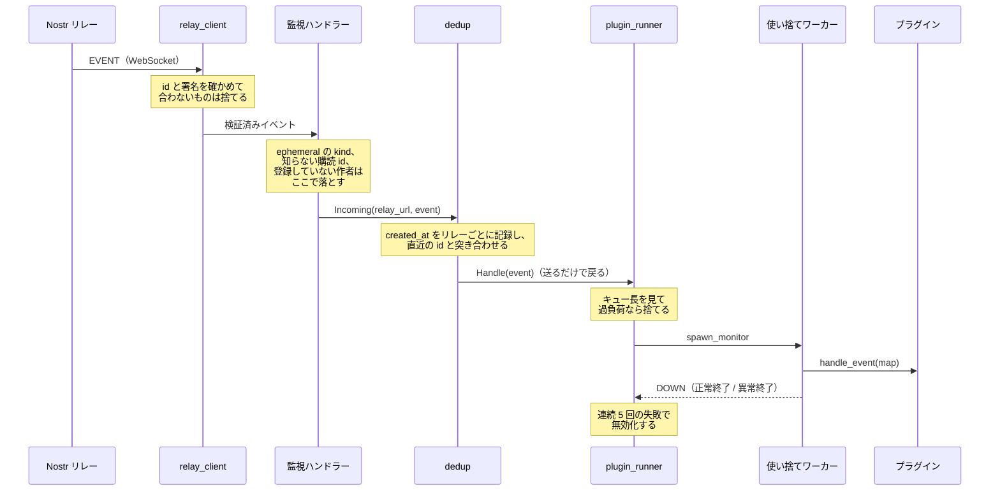
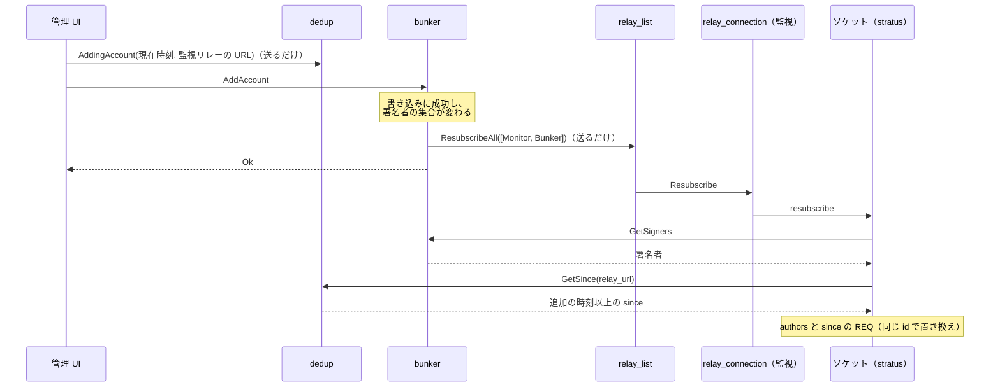
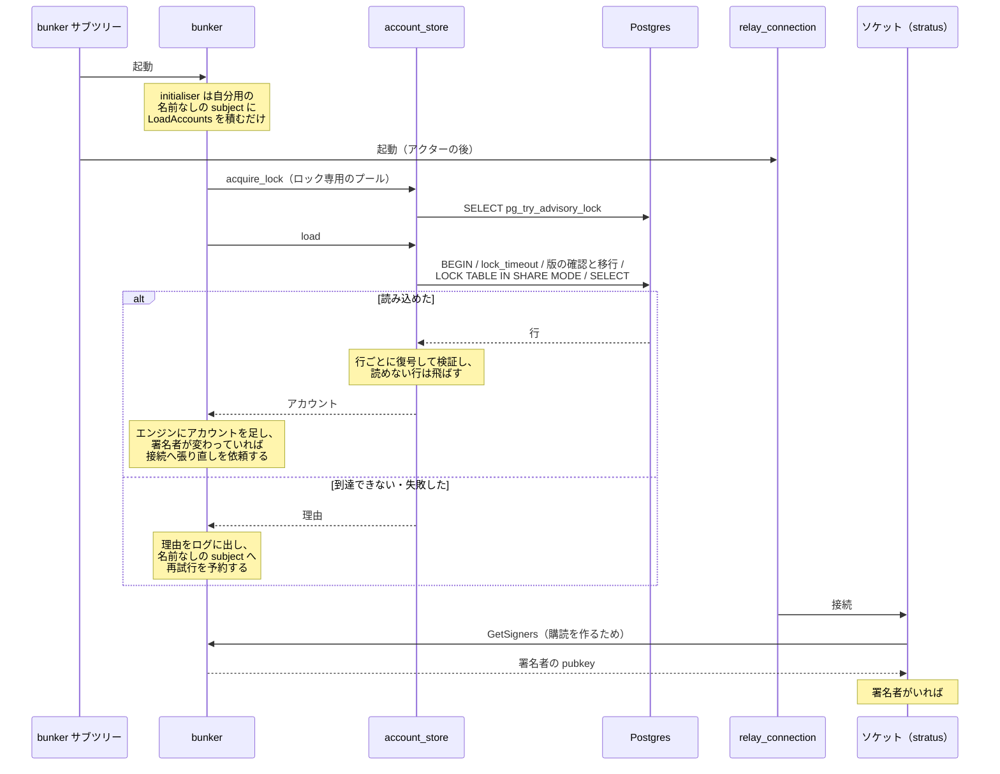
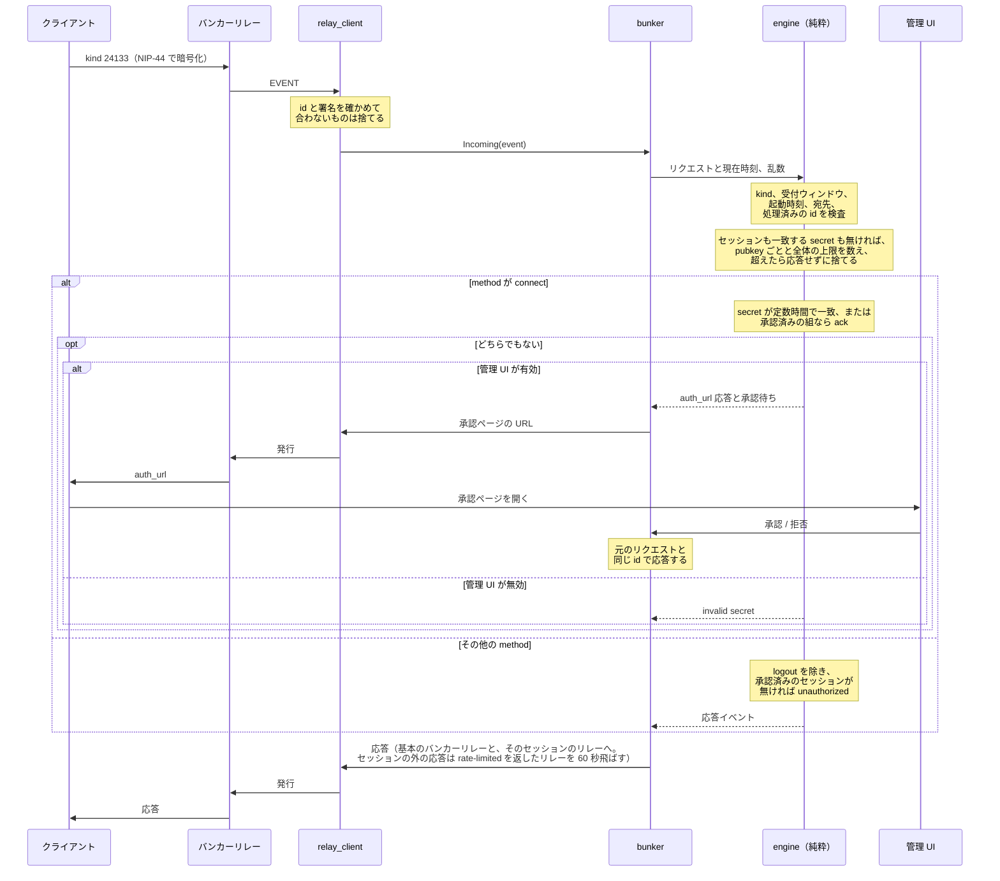
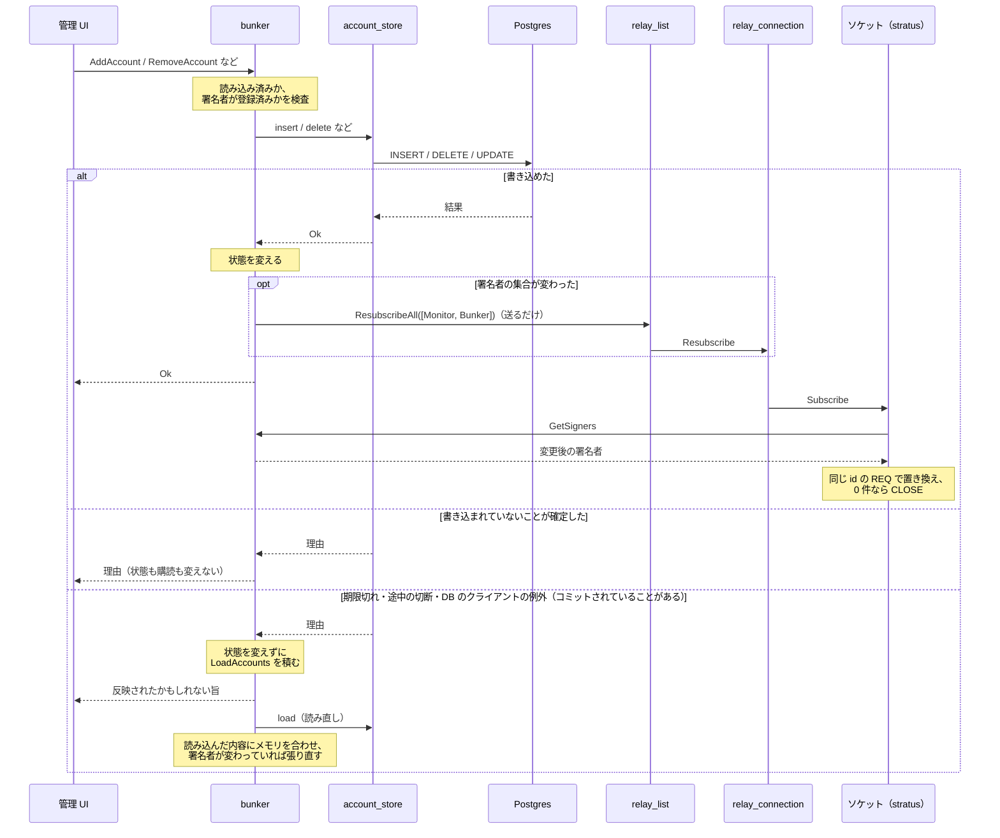
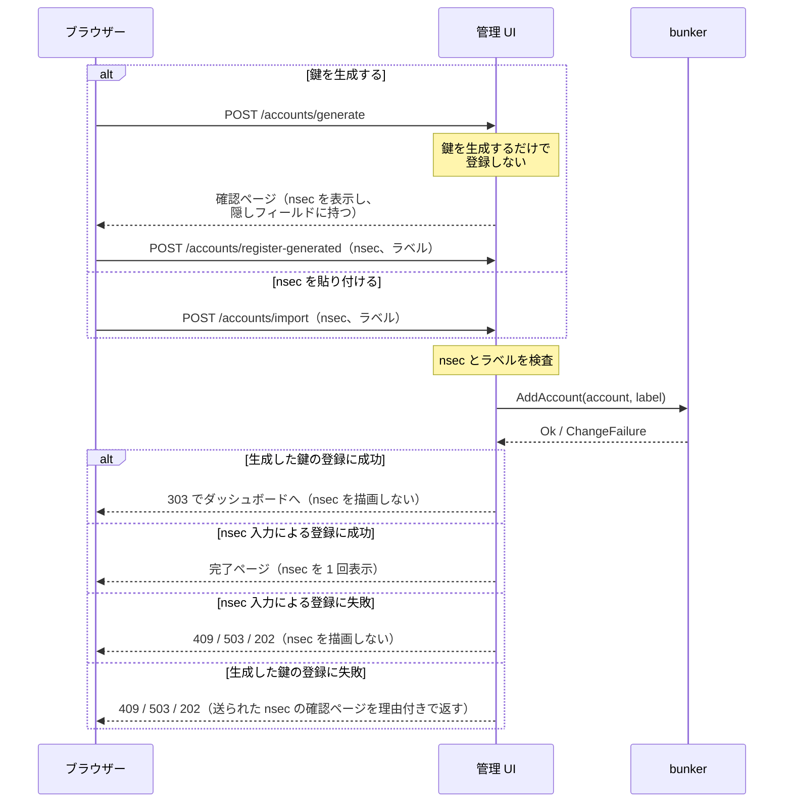
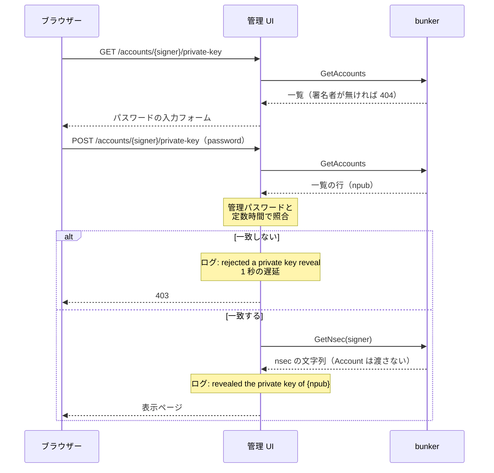
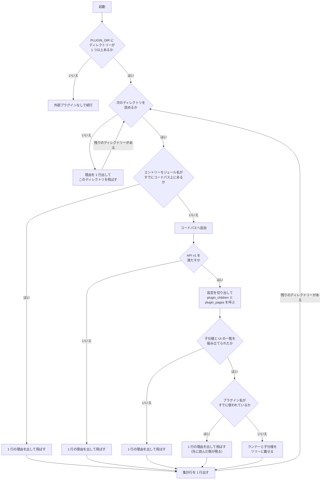

# システム構成

この文書は、Nostr-no-Su が何をどう組み立てて動いているかを示す。
読み手として想定するのは、この本体のコードに手を入れる開発者である。
プラグインを書くだけなら [プラグイン API v1 の仕様](plugin-api.md) を読めばよく、この文書は要らない。

扱うのは、プロセスの構造、イベントとリクエストが通る経路、プラグインの読み込み、ディレクトリの配置、設定の読み手である。
判断の理由は、その判断が他の部分の形を決めている場合にだけ添える。
それ以外の理由は各モジュールの doc コメントにあるので、そちらへ譲る。

## 全体像

本体は 4 つの独立した部分からなる。



監視とバンカーはリレーへの接続を共有しない。
`relay.nsec.app` のように kind 24133 以外の購読を拒否するリレーをバンカー専用に使えるようにするためで、`relays` テーブルの行はリレーごとに用途（監視、バンカー）を持つ。

管理 UI は他のどの部分にも依存しない。
表示する状態は名前付きアクター（リレーの一覧は、加えてバンカーの DB のプール）への問い合わせで取るので、UI が再起動しても問い合わせ先が再起動しても、配線をやり直す必要がない。
問い合わせが失敗したときはその項目だけを、リレーの接続状態は「未接続」（`disconnected`）、プラグインは「応答なし」（`unavailable`）として描画し、アカウント・承認待ち・セッション・リレーは一覧の代わりにその理由を出す（承認待ち・アカウント・セッションの理由が同じなら、ページの先頭に 1 回だけ出し、各節は「上の理由で取得できません。」の 1 文にする）。ページ全体は失敗させない。
問い合わせの返信先は OTP の `gen_server:call` と同じく monitor の alias なので、タイムアウトの後に届いた応答（接続 secret を含みうる）はランタイムが捨て、UI のハンドラーのメールボックスにもログにも残らない。

## スーパービジョンツリー

常駐するプロセスはすべて `static_supervisor` の下に置く。
ツリーの形は起動時に 1 度だけ組む。
リレーの接続だけは例外で、用途（監視・バンカー・セッションのリレー）ごとの `factory_supervisor`（`connections`）の子とし、`relay_list` が実行時にその起動・停止を行う（「実行時のリレーの増減」を参照）。

ツリーの外で動くプロセスが 3 種類ある。
プラグインのイベント処理を動かす使い捨てワーカーと、`relay_connection` が所有する WebSocket のソケットプロセスと、プラグインからの取得の口（`plugin_api`）がリレー 1 本ごとに開く使い捨ての WebSocket 接続である。
1 つ目は監視だけを張り、2 つ目はリンクを張ったうえで exit を trap する。3 つ目は問い合わせを集める使い捨てプロセスが、集め終えた時点でリンクを解き、購読の CLOSE と close フレームを送らせて止まるのを短い期限まで待ち、止まらなければ kill する（`relay_client.disconnect`）。
いずれも所有者が死を検知するので、スーパーバイザーの再起動許容回数を消費しない。

```
root (one_for_one, 3/60)
├── relay_list   (worker)              実行時のリレーの一覧と connections の子の起動・停止
├── plugins      (one_for_one, 5/10)   プラグインごとのランナー（内蔵と外部を合わせてプラグインが 1 つ以上あるときだけ）
│   ├── children(<plugin>) (one_for_one, 5/10, Temporary)  子仕様を持つプラグインだけ
│   │   └── <プラグインが申告した子プロセス>
│   └── runner(<plugin>)   (worker, Permanent)
├── bunker       (rest_for_one, 5/10)  接続プール、ロックのプール、バンカーアクター、次に connections と session_connections
│   ├── account_pool      (pog, supervisor)  アカウントストアの接続プール
│   ├── account_lock_pool (pog, supervisor)  同じ DB に 1 インスタンスだけを許す advisory lock 専用の 1 本のプール
│   ├── bunker
│   ├── connections (factory, 5/10)    バンカーリレーの用途の relay_connection
│   │   └── relay_connection × バンカーリレーの数
│   └── session_connections (factory, 5/10)  基本の組に無いセッションのリレーの relay_connection
│       └── relay_connection × そのリレーの数
├── monitor      (rest_for_one, 5/10)  重複排除ディスパッチャー、connections、再開点の保存
│   ├── dedup
│   ├── connections (factory, 5/10)    監視リレーの用途の relay_connection
│   │   └── relay_connection × 監視リレーの数
│   ├── resume_saver
│   └── plugin_resume_saver
└── admin        (mist)                管理 UI の HTTP サーバー（ADMIN_PORT が有効なときだけ）
```

監視とバンカーのサブツリーが `rest_for_one` なのは、先頭のアクターが再起動したときに後続の接続もまとめて落とすためである。
接続は復帰の過程で購読を張り直し publisher を登録し直すので、再起動したアクターが再び生きたソケットに配線される。
一方、アカウントの変更ではバンカーアクターを再起動しない（再起動すると接続が落ち、リプレイ防止の `seen` が空になる）。
署名者の集合が変わったら、アクターは `relay_list` に監視とバンカーの両方の用途を指定した `ResubscribeAll` を送るだけで、`relay_list` がその用途の現在の全接続へ購読の張り直しを依頼し、各接続アクターが生きたソケットに購読を合わせ直させる（「アカウントの変更」の節）。監視の購読も署名者から組み立てるためである。
アクターは `ResubscribeAll` を送る前に、監視が作者の照合に読む署名者の写し（`bunker.is_signer`）を persistent_term に置き直す。

バンカーのサブツリーだけは、アクターの前に接続プールを置く。
pgo はチェックアウト先のプール名が未登録だと、呼び出し側のプロセスを `noproc` で exit させる。
プールを先頭に置けば、アクターはプールの登録後にしか起動せず、プールが落ちればアクターも止められてから起動し直すので、未登録のプールを叩く状況が構造上生じない。
DB の停止や再起動ではプールのプロセスは死なない（pgo が再接続を内部で扱い、クエリーは値で失敗する）ので、プールの再起動に伴ってアクターが再起動するのは、プール自体のバグか外部からの kill のときに限られる。
ロックのプールもアクターの前に置く理由は同じで、`account_pool` の次、`bunker` アクターより前に並べる。
`rest_for_one` なので、ロックのプールが再起動すると後続のアクターと接続もまとめて再起動し、アクターの初回の読み込みが advisory lock を取り直す（「アカウントの読み込み」の節）。

`plugins` サブツリーがルート直下にあってプラグインのランナーが `one_for_one` で並ぶのは、プラグイン同士が独立で、監視と独立に状態を見せたいからである。
ルートの子は `plugins` を `monitor` より先に追加する。
逆順だとディスパッチャーが未登録のランナー名へ送り、起動直後のイベントを取りこぼす。
`bunker` も `monitor` より先に追加する。
監視の接続は購読を組み立てるたびにバンカーへ署名者を問い合わせるので、逆順だと最初の問い合わせが名前の登録より先に走り、定義を得られずに再試行を待つ。
`relay_list` はすべてより先に追加する。
後だと起動直後に `connections` の factory が送る `Repopulate` が未登録の名前へ送られて捨てられ、初期のリレーが起動されない。

### 実行時のリレーの増減

`relay_list` は用途（監視・バンカー）ごとの接続の一覧を、加えた順に持つ。
バンカーのセッションのリレーのうち、バンカーの用途に無い URL は、バンカーが `transition` で送る `SyncSessionRelays` で受け取り、`session_connections` の子として開閉する（取り消し、`logout`、押し出し、アカウントの削除で使われなくなった URL は閉じる）。`nostrconnect://` の接続では、セッションを開く前に `app.connect_nostrconnect` が（署名者, クライアント）と URI のリレーをバンカーに取り置き（`bunker.reserve_session_relays`）、取り置いたリレーもセッションのリレーと同じ一覧に入る（購読と AUTH は取り置いた署名者で行う）。どれかの接続が応答の発行先になってからセッションを開いて `connect` の応答を出し、最後に取り置きを外す。ほかのセッションがすでに使うリレーでは、取り置きによる購読の張り直しと `connect` の応答が競走し、張り直しより先に届いたリクエストは取りこぼしうる。
`app.open_relay` / `close_relay` / `change_relay_roles` による一覧の変更と、`connections` の子（`relay_connection`）の起動・停止は、`relay_list` 自身のハンドラーで直列に行う。
同時に届く変更が重ならず、最後に処理した変更と一覧が一致するようにするためである。
子を止めるのは `supervisor:terminate_child/2`（`nostr_no_su_ffi` の `terminate_dynamic_child/2`）で、simple_one_for_one のこの関数は子を止めてから仕様ごと消すため、止めた接続は再起動されない。

`connections` は用途ごとの `factory_supervisor` で、`static_supervisor` には無い `start_child` 相当の API を持ち、実行時に子を増減できる。
`rest_for_one` のサブツリー再起動で `connections` ごと落ちると、simple_one_for_one の性質上、動的な子はすべて消える。
`connections` は起動のたびに `relay_list` へ `Repopulate` を送り、`relay_list` はその用途の一覧のうち未登録の接続だけを起動し直す。

止めたバンカーとセッションのリレーの接続は、`relay_connection` の `on_disconnect` を経て `RemovePublisher` が送られ、バンカーの送信先から外れる。
監視の再開点の対象（次節）は、`app.add_account` がその時点の監視の一覧から求めて渡すため、閉じたリレーは以後の対象から外れる。

起動時の一覧は `relay_list` の初期値としては空で渡す。
`relays` テーブルの行は、バンカーが読み込みに成功するたびに `OpenRegistered` で `relay_list` へ渡り、一覧に無い URL だけを足す（不正な URL と用途の無い行は Warning 1 行を出して飛ばす）。
DB に一度も届いていない間や読み込みが失敗している間は、リレーの接続を新たに開かない（すでに開いている接続は閉じない）。

詳細な決定と既知の窓は `relay_list` のモジュール doc を参照。

### 再起動の許容回数に頼らない設計

ルートの `restart_tolerance(3, 60)` は、復旧できないサブツリーを抱えたままループするより、プロセスごと終了してコンテナーの再起動ポリシーに委ねるための設定である。

毎イベントでクラッシュするプラグインに対して、有限の再起動許容回数は原理的に成立しない。
どんな値を設定しても、秒間数十件のイベントが来ればサブツリーは許容回数を使い切り、ルートもやがてアプリを終了させる。
そこで、プラグインの不調でそもそもプロセスが死なないようにしている。

- プラグインのイベント処理関数は、イベント 1 件ごとの使い捨てプロセスで動かす。
  ランナーはそのワーカーとリンクを張らず監視だけを張るので、例外も異常終了もランナーには伝播しない。
- プラグインが申告した子プロセスは普通にクラッシュループしうるので、プラグイン 1 つぶんの子を専用のスーパーバイザーにまとめ、その子仕様を `Temporary` にする。
  子スーパーバイザーが許容回数を使い切って終了しても、親はそれを再起動せず、自分の許容回数も減らさない。

親の許容回数が減らないのは、`Temporary` だからではない。
そのとき子は理由 `shutdown` で終了し、親では理由ベースの分岐に当たって再起動の記録そのものが行われないからで、これは `Transient` でも同じである。
`Temporary` を選ぶ理由は別にあって、諦めた子の仕様が親から削除されること（`Transient` は死んだまま一覧に残る）と、許容回数超過以外の理由で落ちたときに再起動されないことの 2 つである。

詳しくは `src/nostr_no_su/app.gleam` と `src/nostr_no_su/plugin_runner.gleam` の doc コメントに、OTP のどの節がそう振る舞うかの出典つきで書いてある。

DB の障害も同じ考え方で、プロセスの死にしない。
DB の停止はプールのプロセスを殺さず、バンカーアクターはストアの失敗で落ちずに再試行を予約するだけで、起動時にも DB を待たない（次節）。
pog が写せないエラーで `pog.execute` が例外を投げても、`account_store` がクエリーの実行の入口で例外のクラスと発生箇所だけを持つ値（`Raised`）に写すので、ストアの失敗として扱われ、書き込みなら期限切れと同じく読み直す。
したがって DB が落ちていてもルートの許容回数は消費されず、プロセスは落ちず、プラグインは動き続ける。
監視とバンカーのリレーの接続は、最初の読み込みが成功した後に開き、その後の DB の障害では閉じない。
例外は DB のスキーマの版がビルドより新しいときで、待っても直らないのでプロセスを終了する（「アカウントの読み込み」の節）。

## イベントが流れる経路

監視リレーから届いたイベントがプラグインに渡るまでを追う。



`relay_connection` はこの経路には現れない。
ソケットを所有して切断を検知し再接続を予約するのがその役目で、イベントそのものは `relay_client` がハンドラーへ直接渡す。
不安定なリレーがスーパーバイザーの再起動許容回数を消費しないよう、接続が死んでも道連れにならない作りにしてある。
受信が途絶えたソケットは、`relay_client` が一定間隔で ping を送って確かめ、応答が無ければ自ら止まるので、ハーフオープンの接続も同じ経路で張り直される。

遅いプラグインが他のプラグインへの配信を止めないのは、ディスパッチャーがランナーへ送った時点で戻り、プラグインの実行時間がそこに載らないからである。

重複排除は有界なスライディングウィンドウで行う。
複数のリレーが同じイベントを配信し、再接続のたびに保存済みイベントが再送されるため、同じ id を 2 度プラグインへ渡さないようにしている。
ウィンドウは有限なので、同じイベントが 2 度渡ることがある。
プラグインの取り直しの購読のイベントはこのディスパッチャーを通らないので、ランナーが自分の有界なウィンドウで同じ id を弾く。
ランナーの過負荷で捨てたイベントは戻らないので、配信は best-effort である（[プラグイン API v1](plugin-api.md) の第 4 章）。
無効化と再起動の間に捨てたイベントは、再開点があれば復帰したランナーの取り直しの購読で配り直す（[プラグイン API v1](plugin-api.md) の第 4.2 節）。

プラグインが受け取るのは Gleam のレコードではなく binary キーの Erlang map である。
レコードはランタイムではタプルなので、フィールドを 1 つ足すだけで既存のプラグインが黙って壊れる。
map なら Erlang や Elixir で書いたプラグインも載せられる。

## 監視の購読

監視の接続は、接続の直後と張り直しの依頼のたびに購読の定義を評価する。
定義は、バンカーの現在の署名者（`GetSigners`）と、その接続の再開点から組み立てる（`nostr_no_su.monitor_subscriptions`）。
署名者が 0 件なら購読を定義せず、再開点も読まない。
どれかに応答が無ければ、開いている購読を変えずに再試行する。
定義を得たら、その接続が開いている購読と最後に送ったフィルターに照らし、差分だけを送る（`relay_client.sync`）。
開いている購読が定義を覆う（`since` 以外が同じで、送った `since` が無いか定義の `since` 以下）なら REQ を送らず、覆わなければ同じ id の REQ で置き換え、定義から消えた購読には CLOSE を送る。
リレーが購読を CLOSED で閉じたら、その購読を開いていないものとして扱い、理由の NIP-01 の接頭辞で扱いを分ける。
`blocked:`、`restricted:`、AUTH の受け口の無い接続（監視の接続）での `auth-required:` は、次の再接続か張り直しの依頼までその購読を張り直さず、ログを 1 行出す。
それ以外は再試行を予約して張り直す。
この待ちは定義を得られないときの待ちとは別に数え、閉じられるたびに倍に延び（`rate-limited:` は一度に上限の 2 分まで延ばす）、張り直しの依頼で定義を得ると初期値に戻る。
接続は開いている購読を持たずに始まるので、切断からの再接続では定義のすべての購読に REQ を送り、CLOSED で外した購読にも張り直しで REQ を送る。

再開点は、ディスパッチャーのメモリ（`dedup/resume`、`GetSince`）にあればそれを、無ければ DB の `monitor_resume` の値を使う。
メモリの値は保存済みの値以上である（保存の周期は 5 秒だが、メモリの値は DB の値を `since` にした購読で受け取ったイベントか、追加の時刻から決まるため、常に DB の値以上になる）。
記録を接続ではなくディスパッチャーに置くのは、接続のプロセスが切断で死ぬためと、監視の購読で届き、監視ハンドラーの照合を通ったイベントがすべてディスパッチャーを通るためである。照合で落としたイベントは再開点を動かさない。

プラグインが復帰したときは、通常の購読に加えてそのプラグインの取り直しの購読（`nostr-no-su-catchup-<プラグイン名>`）を定義する。
復帰の契機はランナーの起動（本体の再起動、ランナーのクラッシュからの復帰）と、管理 UI からの再有効化の 2 つで、過負荷からの復帰は含まない。
`since` はランナーのメモリの再開点、無ければ DB の `plugin_resume` の値で、どちらも無ければこの購読を定義しない。
`until` は復帰の時刻とその接続の監視の購読の `since` の小さいほうで、それより後のイベントは通常の購読が運ぶ（境界の秒は両方が運ぶ）。
`since` がその `until` を超える取り直しは、その接続では定義しない。全接続で定義しないときは要求が残り、以後の評価で範囲が残った接続の取り直しの EOSE で落ちる（その間のイベントは監視の購読が運ぶ）。監視の購読が `since` を持たない接続では、`until` を復帰の時刻のままにする。
監視の購読の `since` はその接続で受け取ったイベントの最新の `created_at`（受け取った時刻より未来なら受け取った時刻）以上なので、無効の間やランナーの不在の間に配って捨てたイベントは、それを運んだ接続の取り直しに残る。監視の `since` は受け取るたびに前進するので、取り直しの `until` も評価ごとに復帰の時刻まで前進しうる。
監視の購読の `since` は変えない。
要求はリレーが保存済みイベントの終わり（EOSE）を告げるまで残り、最初に告げたリレーの時点でランナーが要求を落として購読を張り直させる（その範囲を持たないリレーが先に EOSE を返すと、取り直しはそこで終わる）。
この張り直しで定義から消えるのは取り直しの購読だけなので、監視の各接続は取り直しの id の CLOSE だけを送り、監視の購読とバンカーの購読には REQ を送らない。
ランナーの起動、再有効化、取り直しの完了による張り直しは、`relay_list` が監視の用途の接続だけへ送り、バンカーの接続には送らない（バンカーの購読はプラグインに関わらず、kind 24133 を保存するリレーは REQ のたびに直近 60 秒のリクエストを送り直すため）。
取り直しで届いたイベントはディスパッチャーを通さず、購読 id のプラグインのランナーへ直接渡る。
ランナーが EOSE の前に落ちて同じ秒のうちに復帰すると、取り直しの要求は落ちる前と同じ範囲になり、開いている取り直しの購読が覆うので REQ を送り直さない。
残りのイベントと EOSE は復帰したランナーへ渡るが、落ちたランナーに渡ったイベントは取り直さない。

保存は `resume_saver` が 5 秒ごとに写しを取り、変わったリレーだけを値を小さくせずに書く。
DB の遅さをディスパッチャーに持ち込まないためである。

起動時に接続の直後の評価と読み込みによる張り直しの評価が続いても、後の評価の `since` は先の評価以上なので、REQ は 1 回だけ送る。



`AddingAccount` を書き込みより前に送るのは、張り直しの `GetSince` より先にディスパッチャーへ届けるためである。
監視リレーの URL は、その時点で `relay_list` に載っている一覧から `app.add_account` が求めて渡す。
バンカーの張り直しのコールバックは起動時の読み込みや削除でも呼ばれるので、追加の時刻には使わない。

## アカウントの読み込み

バンカーアクターは起動したあとで、アカウントを Postgres から読み込む。



`LoadAccounts` は initialiser が積むのでアクターのメールボックスの先頭になり、接続はアクターの後に起動するので、`GetSigners` は必ず読み込みの後に処理される。
DB が起動時に到達可能なら、どの接続も読み込み済みの署名者で購読する。

読み込みの前に、ロック専用の 1 本のプールでセッション単位の advisory lock を取る。別のセッションが持っていれば、`SchemaTooNew` と同じく起動処理が VM を止める。ロックは再入で取り直すだけなので、読み込みのたびに呼ぶ。

読み込みのトランザクションは、一覧を読む前にスキーマの版を確かめる。
`schema_version` に記録された版より新しい移行（`account_store.migrations`）を順に実行し、移行ごとに版を記録する。
記録された版がビルドの最新の版より新しいときは、再試行しても変わらないので、起動処理が組み立てたストアの操作（`nostr_no_su.account_store_operations`）が理由を 1 行出して終了コード 1 で VM を止める。
版 2 は監視の購読の再開点のテーブル（`monitor_resume`）である。監視はバンカーの署名者が 1 件以上のときだけこのテーブルを読むので、読むのは読み込みが 1 回成功した後になる（「監視の購読」の節）。
版 3 は承認済みのセッション（`bunker_sessions`）と承認待ち（`bunker_pending`）のテーブルで、読み込みは同じトランザクションでこれらも読む。どれかが読めなければ読み込み全体が失敗する。
版 4 は登録したリレーのテーブル（`relays`）である。読み込みは同じトランザクションでこれも読み、読み込みが成功するたびに行を `relay_list` へ渡す（「実行時のリレーの増減」の節）。
版 5 はプラグインごとの再開点のテーブル（`plugin_resume`）である。ランナーが処理したイベントの `created_at` で前進し、保存のアクターが 5 秒ごとに書く。取り直しの購読もこのテーブルを読むが、監視と同じく署名者が 1 件以上のときだけなので、読むのは読み込みが 1 回成功した後になる（「監視の購読」の節）。
版 6 は承認済みのセッションと承認待ちの行の MAC（`mac` 列）である。版 5 までの行は MAC を持たないので、移行は `bunker_pending` と `bunker_sessions` の既存の行をすべて消してから列を足し、消えた分のクライアントは接続をやり直す（承認を経る URI で接続したクライアントは承認もやり直す）。MAC はマスターキーから導く鍵の HMAC-SHA256 で、入力はテーブルの区別と主キーを含む全列である。読み込みでは MAC の合わない行を使わず、トランザクションを抜けた後に 1 行ずつ Warning で出す（`vault.describe_rejected`）。守る範囲は [設計上の判断と既知の制約](design-decisions.md) の「DB への書き込みと行の MAC」を参照。
版 7 は承認済みのセッションの URI のリレー（`relays` 列、文字列の配列）である。`nostrconnect://` で開いたセッションは URI に現れた順のリレーを持ち、`bunker://` の `connect` と承認で開いたセッションと、移行の前からある行は空の一覧を持つ。MAC の入力は、一覧が空でなければ各要素をバイト数つきで連結した 1 列を末尾に足し、空なら足さないので、移行の前の行は版 6 の MAC のまま読める。

再試行を名前なしの subject へ予約するのは、名前付き subject へのタイマーが名前宛てになり、再起動した後の同じ名前のアクターに届いて再試行が重複するためである。
名前なしの subject は pid 宛てなので、アクターが終了するとランタイムがタイマーを取り消す。

DB が起動時に到達できなかった場合も、読み込みが後から成功した時点で署名者の集合が変わるので、アクターは再接続を待たずに購読の張り直しを依頼する（次節の図と同じ経路）。
DB に到達できる通常の起動でも、1 件以上を読み込めば同じ依頼が出るが、接続が開いている購読が同じ定義を覆うので、REQ は送り直さない。
依頼を省く条件を足さず、規則を「署名者の集合が変わったら張り直す」の 1 つに保ち、送るかどうかは接続の照合が決める。

## NIP-46 リクエストが流れる経路

クライアントからの署名要求は、監視とは別の接続で受ける。



イベントの id と署名は、受信した接続のプロセス（`relay_client`）が確かめる。
署名の検証は 1 件あたりミリ秒単位で、バンカーのアクターの中で行うと、署名の合わないイベントを送り続けるだけで承認や一覧を含むすべての処理が止まるためである。
`engine` が受け取る `event.Verified` は `event.verify` でしか作れず、それ以外の判断はすべて `engine` に置いてある。
アクターが持つのはセッション状態と、乱数や現在時刻のような外界からの入力だけである。
リレークライアントは切断のたびに再起動されるため、セッション状態をそこに置けない。

応答はどのリレーから来たリクエストでも、基本のバンカーリレー（`relays` テーブルでバンカーの用途を持つリレー）と、応答先のセッションのリレーへ発行する（`bunker.response_relays`）。セッションの無い応答と、リレーを持たないセッション（`bunker://`）への応答は基本のバンカーリレーだけへ出る。
ただし、`rate-limited:` の OK を返したリレーへは、セッションの外のリクエストへの応答を 60 秒出さない（`bunker.recipients`。理由は [設計上の判断と既知の制約](design-decisions.md) の「NIP-46 の入力にはサイズと件数の上限がある」）。
クライアントは `bunker://` URI の `relay=` をすべて聴くので、リレーが 1 つ生きていれば往復が成立する。

### リレーの AUTH（NIP-42）への応答

バンカーの接続はリレーからの AUTH（challenge を運ぶ制御メッセージ）にも応答する。
`relay_client` は challenge を受けると、接続に渡された `Authenticator`（`bunker.authenticate` を relay_url と接続の範囲で部分適用したもの）へ同期に問い合わせ、基本のバンカーリレーの接続では登録アカウントごと、セッションのリレーの接続ではその URL を持つセッションと取り置き（`nostrconnect://` の接続の間）の署名者ごとに署名した kind 22242 を得て、同じ接続へ `AUTH` で送る。
監視の接続には `Authenticator` を渡さないため、AUTH には応答せずログに出すだけである。
リレーが challenge を送るたびに、その時点で読み込み済みのアカウント（セッションのリレーの接続では、その時点でその URL を持つセッションと取り置きの署名者）で応答する。接続ごとの「応答済み」の状態は持たないため、同じ接続で challenge が再送されればそのたびに応答し直す。最初の `Authenticate` は `GetSigners` と同じ理由（「アカウントの読み込み」の不変条件）で必ず最初の `LoadAccounts` の後に処理されるため、DB に到達できれば読み込み済みのアカウントで応答する。最初の読み込みが失敗したときは 0 件で応答する。バンカー側からアカウントの変化を契機に再認証を始める経路は無いため、その後の読み込みの成功や接続確立後のアカウントの追加は、リレーが再び challenge を送るか再接続するまでその接続の認証に反映されない。

## アカウントの変更

アカウントの追加・削除・secret の作り直し・ラベルの差し替えは、バンカーアクターを再起動せずに反映する。



書き込みはアクターの中で行い、成功したときだけ状態を変える。
書き込みが期限を過ぎたとき、途中で接続が切れたとき、DB のクライアントが例外を投げたときは、サーバー側でコミットされていることがあるので、メモリを変えずに読み直して合わせる。
合わせる処理はエンジンを作り直さず、ストアに無い署名者を取り除いて読み込んだアカウントを足す。アカウントを合わせた後に、読み込んだセッションと承認待ちでエンジンのものを置き換える（`engine.restore`）。
読み直しに失敗したら起動時の読み込みと同じく名前なしの subject へ再試行を予約し、成功するまでの間は変更を拒否する。
読み直しは管理 UI の「DB から読み直す」（`POST /accounts/reload`）からも要求でき、読み込めていない間の要求は既に読み直しが進んでいるので何もしない。
読み込みは 1 本のトランザクションで `LOCK TABLE bunker_accounts, bunker_pending, bunker_sessions IN SHARE MODE` を取ってから一覧を読む。
PostgreSQL は列挙の順に 1 つずつロックを取るので、書き手の順（承認は `bunker_pending` の DELETE の後に `bunker_sessions` へ INSERT する）に合わせ、アカウントの削除（連鎖を含む）が最初に触る `bunker_accounts` を先頭に置く。
SHARE は実行中の書き込みが持つ ROW EXCLUSIVE と衝突するので、期限を過ぎた後もサーバー側で実行を続けている書き込みがあれば、その終了を待ってから読む。
メモリは成功した書き込みと成功した読み込みの結果だけで変わり、結果が曖昧な書き込みの後は、読み直しに成功した時点でその書き込みの結果を含めて DB と一致する。
残る窓として、期限の直前に送った文がサーバーに届いてロックを取るより先に読み直しがロックを取ると、その書き込みは読み直しに見えない（ローカルの測定では、コミットされた期限切れの挿入 704 件で 0 件）。
読み直しが失敗し続ける間は、再試行のたびに読み込みの期限（3 秒）まで NIP-46 の処理が待たされる。
再試行の間隔は 5 秒から失敗のたびに倍に延びて 2 分で頭打ちになり、読み込みに成功した後の失敗では 5 秒から数え直す。
書き込みの間に届いた NIP-46 のリクエストはメールボックスに積まれ、書き込みの後に処理される。

張り直しの依頼を接続アクター経由にしているのは、再接続との競合を閉じるためである。
接続アクターはメッセージを逐次に処理するので、接続の途中に届いた依頼は新しいソケットを保持した後に転送され、再接続を待っている間の依頼は次の接続が購読を評価し直すことで満たされる。
いずれの場合も、ソケットが送る `GetSigners` は変更の処理が返った後にアクターへ届くので、最後に送られる REQ は変更後の署名者から作られる。

ソケットは購読の定義を、開いている購読 id と最後に送ったフィルターに照合する（`relay_client.sync`）。
`GetSigners` に応答が無いときは定義を得られなかったものとして、開いている購読を変えずに再試行を 1 つだけ予約する。
応答が無いことを署名者 0 件と区別しないと、アクターが遅い書き込みで詰まっている間に、全署名者の購読を CLOSE してしまうからである。

管理 UI は、変更の結果を型 `bunker.ChangeFailure` で受け取り、状態コードに写す。
文言は本文に出すだけで、分岐には使わない。
`MaybeApplied` は原因を `bunker.NotConfirmed` で持ち、管理 UI が表示の言語の文言に写す。

| 結果 | アクターのどの分岐から来るか | 管理 UI の応答 |
| --- | --- | --- |
| `Ok(Nil)` | 書き込めた | 303 でダッシュボードへ（nsec 入力による登録は 200 の完了ページ） |
| `NotApplied` | `NotWritten` | 409 でフォームに英語の理由を出す |
| `AccountAlreadyRegistered` | 登録済みの検査（`require_unregistered`）、`AlreadyStored` | 409 でフォームに訳した理由を出す |
| `AccountNotRegistered` | 未登録の検査（`require_registered` / `require_registered_or_skipped`） | 409 でフォームに訳した理由を出す（一覧に無い署名者の 404 と同じ文言） |
| `NotReady` | 読み込みか読み直しの前（`Loading`） | 503 の通知ページ（生成した鍵の登録では、生成した鍵の確認ページに理由を出す） |
| `MaybeApplied` | `MaybeWritten`、変更の問い合わせのタイムアウト | 202 の通知ページ（生成した鍵の登録では、生成した鍵の確認ページに理由を出す） |

`MaybeApplied` を 409 にしないのは、反映されたかもしれない変更を「拒否された」と見せると、利用者が同じ変更をやり直し、secret の作り直しならもう一度作り直してしまうからである。
アカウント 1 件の操作は変更の前に一覧を引くので、一覧に無い署名者（削除済みの署名者への再送など）はバンカーに届く前に 404 になる。
`require_registered` の拒否（`AccountNotRegistered`、409）が届くのは、管理 UI が一覧を引いてからバンカーが変更を処理するまでの間に削除された場合（同時に送られた削除など）だけである。
利用者がダッシュボードを開いた後に削除されたアカウントは、操作の時点で一覧に無いので 404 になる。
`NotReady` を `NotApplied` と分けるのは、時間をおけば同じ変更を受け付けうる一時的な状態だからで、一覧を得られないときの 503 と揃えている。

承認・拒否（`POST /approve/<token>`、`POST /deny/<token>`）、セッションの取り消し（`POST /sessions/revoke`）、権限の編集（`POST /sessions/<signer>/<client>/permissions`）は、結果を同じ型 `bunker.SessionFailure` で受け取り、`admin.session_failure_response` が次の 4 区分に写す。権限の編集だけは `SessionNotApplied` を通知ページにせず、送られた値でフォームを描き直す（409 は変わらない）。

| 構築子 | 管理 UI の応答 |
| --- | --- |
| `SessionNotFound` | 404（対象が無い。不明、失効、処理済み、承認済みでない組） |
| `SessionNotApplied` | 409（書き込まれていないことが確定した） |
| `SessionNotReady` | 503 の「バンカーを利用できません」（読み込み・読み直しの前） |
| `SessionMaybeApplied` | 503 の「変更を確認できませんでした」（反映されたか分からない） |

`SessionNotApplied` を `SessionNotReady` と分けるのは、`NotReady` は時間をおけば同じ操作を受け付けうる一時的な状態（一覧を得られないときの 503 と揃えている）だが、`SessionNotApplied` は書き込まれていないことが確定しており、やり直してよいからである。アカウントの変更の `NotApplied` / `NotReady` と同じ理由による。
`SessionMaybeApplied` をアカウントの変更と違って 202 にしないのは、承認・拒否・取り消しは再送しても害が無い（反映済みなら 404。書き込みの結果が曖昧だったときはバンカーが DB を読み直してセッションと承認待ちを揃えるので、書けていれば再送は 404、書けていなければ再送で受け付けられる）からで、権限の編集も同じ値を書き直すだけなので再送してよいからである。
承認ページの GET と承認・拒否の POST の前の照合も、承認待ちの一覧を得られなければ `SessionNotReady` と同じ 503 にする（取り消しは承認待ちの一覧を引かない）。

プラグインの再有効化（`POST /plugins/reenable`）は、結果を型 `admin.ReenableFailure` で受け取る。
成功は 303、名前に一致するプラグインが無い（`PluginNotFound`）は 404、ランナーの無応答（`PluginNotAnswered`）は 503 にする。
プラグインのページのフォームの送信は `admin.Context` の `plugin_page_action` が返す関数に委ね、その `Error` の理由がそのまま 503 の通知ページに出る（[プラグイン API v1](plugin-api.md) の第 13.6 節）。

## アカウントの登録と秘密鍵の再表示

管理 UI は秘密鍵をサーバーに保持しない。
鍵はブラウザーとの間を POST の本文とその応答の本文だけで往復し、クエリー文字列にもリダイレクト先にも載らない。
書き込み、状態の変更、購読の張り直し、結果が曖昧なときの読み直しは、前節の「アカウントの変更」と同じ経路を通る。



生成と登録を分けるのは、生成の確認ページ（`POST /accounts/generate` の応答）の再読み込みで POST が再送されても何も登録されないようにするためである。
1 回の POST で生成と登録を行うと、再送のたびに別の鍵のアカウントが登録される。
生成した鍵の登録でラベルが規則に反したときと、バンカーが登録に失敗したとき（409 / 503 / 202）は、送られた nsec の確認ページを理由付きで返し、生成した鍵を失わないようにする（nsec が不正なら登録画面に戻す）。



`GetNsec` の応答が `Account` ではなく nsec の文字列なのは、管理 UI のプロセスが署名や復号に使える値を持たないようにするためである。
要求は公開鍵と返信先しか持たず、応答は alias の問い合わせで受けるので、タイムアウトの後に届いた nsec はランタイムが捨てる。
アクターは読み込みか読み直しの前（`Loading`）には答えない。
ログに出すのは一覧の行の npub だけで、パスワードも nsec も出さない。

## 管理 UI のルート

`/healthz` 以外はすべて Basic 認証を要する。
認証に失敗した要求は、理由（資格情報なし、形式の誤り、資格情報の不一致）と接続元の IP を `[admin]` の 1 行でログに出す。
資格情報とパス（承認ページのトークンを含みうる）は出さない。IP は TCP の接続元で、`X-Forwarded-For` は見ない。
応答は 1 秒の固定の遅延の後に返し（秘密鍵の再表示で管理パスワードの再入力が一致しない 403 も同じ）、ロックアウトと IP ごとの回数制限は入れない（必要なら前段のリバースプロキシーで行う）。
状態を変えるルートはすべて POST で、`Origin` / `Referer` と `Host` を突き合わせる CSRF の検査の下にある。
`Host`、`Origin`、`Referer` のどれかに制御文字を含む要求は、メソッドによらずその検査の前に text/plain の 400 で弾く（検査が不一致のときにログへ出す生の値に、端末の制御を入れさせないため）。
認証済みの応答にはすべて `cache-control: no-store`、枠への埋め込みを禁じるヘッダー、実行するスクリプトを管理 UI のファイルに限る CSP、`x-content-type-options: nosniff`、`referrer-policy: same-origin` を付ける。
ページとフォームのパスの定義は `admin/dashboard.gleam` に、スタイルシート、スクリプト、テーマと言語の切り替えのパスの定義は `admin/view.gleam` に置き、ルーティングと、フォームの `action` とページ枠の `link` と `script` が同じ定義を見る。
ページは lustre の要素ツリーで組み立て、`admin/view.gleam` の `page`（見出しがプラグイン由来の文字列のプラグインのページは `page_in_language`）で HTML 文書の文字列にする。
見た目は Tailwind CSS と daisyUI のクラスで付け、鍵の指紋の色だけは `assets/admin.css` に手で書いたクラス（`fp`、`h0`〜`h11`、`fp-gray`）とテーマの変数で付けて、ビルドした CSS を `/static/admin.css` から読ませる。
JS は `/static/admin.js` に置き、要素の `data-action` の名前で処理を選ぶ（インラインのスクリプトとイベント属性は書かない）。
時刻はサーバーが `<time datetime>` に UTC で描き（JS が無いときは「05:12:34 UTC」のように UTC と分かる表記）、`admin.js` が読み込み時に閲覧者のローカルの時刻に直す。
POST の応答で開いた状態で描いたダイアログは、`admin.js` が読み込み時にモーダルとして開き直す。
ページの言語は認証の後に、切り替えで保存した cookie、`Accept-Language`、英語の順に決め、文言は `admin/i18n.gleam` から引く。言語の切り替えの「ブラウザーの設定」のボタンは cookie を消す。
テーマは切り替えで保存した cookie から決め、無ければブラウザーの設定に従う。

| メソッド | パス | 役割 |
| --- | --- | --- |
| GET | `/healthz` | 認証なしで `ok` を返す |
| GET | `/` | ダッシュボード |
| GET | `/static/admin.css` | ビルドした CSS（`priv/static/admin.css`） |
| GET | `/static/admin.js` | 管理 UI の JS（`priv/static/admin.js`） |
| POST | `/language` | 表示の言語を cookie に保存し（ブラウザーの設定では消し）、フォームが送った戻り先へ 303 で戻す |
| POST | `/theme` | 表示のテーマを cookie に保存し（`system` では cookie を消す）、フォームが送った戻り先へ 303 で戻す |
| GET / POST | `/approve/<token>` | 承認ページ / 承認 |
| POST | `/deny/<token>` | 拒否 |
| POST | `/sessions/revoke` | セッションの取り消し |
| GET / POST | `/sessions/connect` | クライアントの接続のフォーム / `nostrconnect://` URI の解釈と署名者の照合。確認のページを 200 で返し、セッションもリレーの接続も作らない |
| POST | `/sessions/connect/confirm` | 確認のページからの接続。URI と署名者をもう一度確かめてから接続し、303 でダッシュボードへ戻す |
| GET / POST | `/sessions/<signer>/<client>/permissions` | 承認済みのセッションの権限の編集フォーム / 保存。303 でダッシュボードへ戻す |
| POST | `/plugins/reenable` | 無効になったプラグインの再有効化 |
| GET | `/plugins/<プラグイン名>/<ページ>` | プラグインが供給するページ（プラグイン名は percent-encode する） |
| POST | `/plugins/<プラグイン名>/<ページ>` | プラグインのページのフォームの送信 |
| POST | `/accounts/reload` | DB からのアカウントの読み直しの要求。303 でダッシュボードへ戻す |
| GET | `/accounts/new` | 登録画面（nsec の入力と鍵の生成） |
| POST | `/accounts/generate` | 鍵を生成して確認ページを返す（登録しない） |
| POST | `/accounts/import` | nsec 入力による登録。完了ページで nsec を 1 回表示する |
| POST | `/accounts/register-generated` | 生成した鍵の登録。303 でダッシュボードへ戻す |
| GET | `/accounts/<signer>/qr` | 接続 URI の QR コード |
| GET / POST | `/accounts/<signer>/label` | ラベルの編集フォーム / 差し替え |
| GET / POST | `/accounts/<signer>/rotate` | secret の作り直しの確認 / 実行 |
| GET / POST | `/accounts/<signer>/delete` | 削除の確認 / 実行 |
| GET / POST | `/accounts/<signer>/private-key` | パスワードの入力フォーム / 秘密鍵の表示 |
| POST | `/relays/new` | リレーの登録。303 でダッシュボードへ戻す（400 と 409 は追加のダイアログを開いたダッシュボードを返す） |
| POST | `/relays/<id>/edit` | 用途の差し替え。303 でダッシュボードへ戻す（400 と 409 は編集のダイアログを開いたダッシュボードを返す） |
| POST | `/relays/<id>/delete` | 削除。303 でダッシュボードへ戻す（409 は削除のダイアログを開いたダッシュボードを返す） |

承認ページの GET と、承認と拒否の POST も先に承認待ちの一覧を引き、一覧に無いトークンは承認・拒否を呼ばずに 404、一覧を得られなければ 503 にする。
承認、拒否、セッションの取り消し、セッションの権限の編集、クライアントの接続は、署名者とクライアントの公開鍵を `[admin]` の 1 行でログに出し、承認ページのトークンと保存した権限の値は出さない。
再有効化のログは管理 UI ではなくランナーが `plugin <名前>` の接頭辞で出す。

`<signer>` は署名者の x-only 公開鍵の小文字 16 進である。
アカウント 1 件の操作は GET でも POST でも先にバンカーの一覧を引き、一覧に無い署名者は 404 にする。
以降のログとバンカーへの呼び出しには、パスの値ではなく一覧の行の値を使う。

## プラグインが読み込まれるまで

起動時に `PLUGIN_DIR` に並べたディレクトリーを、左から順に 1 度だけ走査する。



読み込みの失敗で起動は止まらない。
弾かれるのは 1 つのプラグインだけで、監視もバンカーも他のプラグインも影響を受けない。
読めないディレクトリーはそこだけ飛ばすので、そのディレクトリーの集計行は出ない。

設定は `PLUGIN_<NAME>_<KEY>` の環境変数を集め、プラグイン名が確定した時点で接頭辞に一致するものだけを切り出して渡す。
設定が足りないときは、プラグインの `plugin_children/0` または `/1` が `{error, Reason}` を返して読み込みを拒否できる。
値の妥当性（接続文字列として解釈できるか、など）は本体には判断できないので、そこをプラグインに委ねている。

管理 UI のページを供給するプラグインは `plugin_pages` でページの一覧を申告し、本体は読み込み時に検証する（[プラグイン API v1](plugin-api.md) の第 13 章）。入力と実行は任意エクスポート `plugin_page_action` で足し、宛先は本体が決める。同梱の `event_logger` は `timeline` と `settings` の 2 ページを供給し、`timeline` はページの組み立ての中で自分の DB を読む。

読み込んだ BEAM は本体と同じ VM で同じ権限で動く。
サンドボックスは無く、秘密鍵を持つアクターの状態にも到達できる。
信頼できるものだけを置くこと（[プラグイン API v1](plugin-api.md) の第 1 章）。

ランナーはプラグインごとの再開点をメモリに持ち、処理したイベントの `created_at` で前進させる。
無効化（`Disabled`）の間のイベントは捨てるだけなので前進せず、過負荷（`Overloaded`）の切り捨てでは前進する。
保存は `plugin_resume_saver` が 5 秒ごとに各ランナーへ問い合わせ、前回の写しと違うプラグインだけを `plugin_resume` に値を小さくせずに書く。
復帰したランナーはこの再開点からの取り直しを要求し、監視の接続に購読を張り直させる（「監視の購読」の節）。

## ディレクトリ構造

```
nostr-no-su/
├── src/                          本体
│   ├── nostr_no_su.gleam         エントリポイント（設定の読み込みとツリー仕様の組み立て）
│   ├── nostr_no_su_ffi.erl       OTP への FFI（crypto / code / file / process / application / ssl / logger / supervisor / pgo / QR）
│   └── nostr_no_su/
│       ├── app.gleam             スーパービジョンツリーの構成
│       ├── config.gleam          環境変数からの設定読み込み
│       ├── admin.gleam           管理 UI の HTTP サーバーとルーティング
│       ├── admin/dashboard.gleam 表示する状態の型、パスとフォームの欄の名前の定義、ダイアログとページが共用するフォームの中身、ダッシュボードと承認と通知のページの描画
│       ├── admin/account_pages.gleam アカウントのページの描画
│       ├── admin/qr.gleam       QR コードの符号化とインライン SVG への変換（純粋）
│       ├── admin/fingerprint.gleam 公開鍵の指紋（5 × 5 の左右対称の模様と 12 通りの色相）の決定とインライン SVG への変換（純粋）
│       ├── admin/connect_pages.gleam クライアントの接続のページと確認のページの描画
│       ├── admin/session_pages.gleam セッションのページの描画
│       ├── admin/permission_view.gleam 権限のチップの描画（未対応の判定はバンカーのエンジンの定義を使う）
│       ├── admin/view.gleam      ページ枠と、admin/i18n と admin/wordmark 以外の本体のモジュールに依存しない部品（lustre）
│       ├── admin/wordmark.gleam  上部のロゴの製品名の字形のパス（dev/logo_wordmark.sh が生成）
│       ├── admin/i18n.gleam      表示の言語の型と選び方、日本語と英語の文言
│       ├── admin/plugin_view.gleam プラグインが返す要素の記述から管理 UI の部品への変換（純粋）
│       ├── admin/plugin_pages.gleam プラグインのページの描画（ページ枠、タブ、節の並び）
│       ├── dedup.gleam           リレー横断の重複排除ディスパッチャー
│       ├── dedup/window.gleam    直近のイベント id のスライディングウィンドウ（純粋）
│       ├── dedup/resume.gleam    監視の購読の再開点の記録（純粋）
│       ├── dedup/resume_saver.gleam 再開点を周期ごとに保存するアクター
│       ├── dedup/resume_store.gleam 監視の購読の再開点の SQL
│       ├── plugin.gleam          プラグイン API v1 の検証と読み込み
│       ├── plugin_api.gleam      プラグインが呼ぶ本体側の口（監視リレーへの送信と取得）
│       ├── plugin_children.gleam 子仕様の検証と ChildSpecification への変換
│       ├── plugin_config.gleam   プラグイン固有の設定の切り出し
│       ├── plugin_loader.gleam   PLUGIN_DIR の走査とコードパスへの追加
│       ├── plugin_resume_store.gleam プラグインごとの再開点の SQL
│       ├── plugin_runner.gleam   プラグイン 1 つぶんの実行プロセス
│       ├── plugins/
│       │   └── console_logger.gleam  内蔵プラグイン（受信を 1 行出す）
│       ├── bunker.gleam          バンカーのアクター（セッション状態を保持）
│       ├── bunker/engine.gleam   NIP-46 リクエスト処理の純粋コア
│       ├── bunker/connection_secret.gleam 接続 secret（閉じ込め、定数時間の比較）
│       ├── bunker/rpc.gleam      JSON-RPC コーデックと入力の上限
│       ├── bunker/rate_limit.gleam セッションの外のリクエストの上限（トークンバケット、純粋）
│       ├── bunker/account.gleam  鍵材料と bunker:// URI
│       ├── bunker/vault.gleam    マスターキーと、アカウントの暗号化形式・行の検証、セッションと承認待ちの行の MAC（純粋）
│       ├── bunker/account_store.gleam アカウント、セッション、承認待ち、リレーの一覧を Postgres に保存するストア
│       ├── bunker/nostrconnect.gleam nostrconnect:// URI の解釈（純粋）
│       ├── nostr/event.gleam     Event 型・コーデック・ID 計算・署名
│       ├── nostr/filter.gleam    購読フィルター
│       ├── nostr/message.gleam   クライアントとリレーのメッセージ
│       ├── nostr/nip19.gleam     NIP-19 の npub / nsec の符号化と復号
│       ├── relay_client.gleam    WebSocket クライアント（stratus）
│       ├── relay_connection.gleam リレー 1 本ぶんの接続を保つアクター
│       ├── relay_list.gleam      実行時のリレーの一覧と connections の子の起動・停止
│       ├── relay_store.gleam     リレーの一覧（relays）の SQL
│       ├── crypto/secp256k1.gleam 点演算・鍵導出・ECDH
│       ├── crypto/bip340.gleam   BIP-340 Schnorr 署名と検証
│       ├── crypto/nip44.gleam    NIP-44 v2 暗号化
│       ├── crypto/aes_gcm.gleam  AES-256-GCM の箱（nonce、暗号文、タグ）
│       ├── backoff.gleam         再試行の待ち時間（失敗のたびに倍にして上限で頭打ち、±20% のジッター）
│       ├── hex.gleam             16 進文字列とバイト列の相互変換
│       ├── keepalive.gleam       WebSocket 接続の生存確認の判定（ping を送る時機と切る時機。純粋）
│       ├── log.gleam             ログ 1 行の組み立てと OTP logger への出力、外部由来の文字列の正規化
│       ├── named.gleam           名前付きアクターへの安全な送信と問い合わせ
│       ├── random.gleam          推測されては困る値のための乱数
│       ├── task.gleam            締め切り付きで並行に走らせる小さな口（管理 UI のダッシュボードが使う）
│       └── time.gleam            現在時刻（壁時計・単調時計、FFI）
│
├── test/                         本体のテスト（gleeunit と qcheck）
│   ├── support/                  テスト用の fixture
│   └── vectors/                  BIP-340 と NIP-44 の公式テストベクター（取得元のまま）
│
├── assets/                       管理 UI の CSS の入力（Tailwind CSS / daisyUI）と、README に載せる製品のロゴ（logo/）
├── priv/static/                  管理 UI の CSS（ビルドした生成物。CI で最新であることを検査する）と JS
├── dev/                          管理 UI の撮影用のサーバーとスクリプト、ロゴの製品名の字形の生成、vendor/stratus、.env.example、2 つの compose の一致、共有パッケージの版、リリースの版の検査、イメージに入れるライセンスの収集（成果物には入らない）
│
├── plugins-src/                  同梱プラグインのソース
│   ├── event_logger/             Postgres へ保存する（独自の依存と設定を持つ）
│   │   ├── gleam.toml            本体とは独立した Gleam プロジェクト
│   │   ├── manifest.toml         共有パッケージの版を本体に合わせて固定する
│   │   ├── src/
│   │   │   ├── event_logger.gleam       API v1 の関数と起動シム
│   │   │   ├── event_logger/store.gleam 保存アクターとスキーマ
│   │   │   ├── event_logger/log.gleam   ログ 1 行を OTP logger へ出力（本体の log.gleam とは別実装）
│   │   │   ├── event_logger/page.gleam  管理 UI のページの記述の組み立て（純粋）
│   │   │   ├── event_logger/i18n.gleam  管理 UI のページの文言の日英
│   │   │   └── event_logger_ffi.erl     子仕様 map の組み立て
│   │   └── test/
│   └── profile/                  プロフィール（kind 0）の表示と更新（DB を持たない）
│       ├── gleam.toml
│       ├── manifest.toml
│       ├── src/
│       │   ├── profile.gleam         API v1 の関数
│       │   ├── profile/i18n.gleam    管理 UI のページの表示の言語と、言語ごとの文言
│       │   ├── profile/page.gleam    管理 UI のページの記述の組み立て（純粋）
│       │   ├── profile_ffi.erl       取得（`fetch_events` の呼び出しと戻り値の変換）、更新の JSON の組み立てと送信、時刻の整形
│       │   └── profile_store.erl     直前の送信の結果と取得のキャッシュ（60 秒）を保持する gen_server
│       └── test/
│
├── examples/plugins/             プラグインの書き方の例
│   ├── file_logger/              状態を持たず、設定を受け取る（Erlang 1 ファイル）
│   └── counter/                  子プロセスを申告する（Erlang 1 ファイル）
│
├── plugins/                      自作プラグインの置き場所（追跡しない。同梱の event_logger と profile はイメージの /app/plugins にある）
│
├── docs/
│   ├── usage.md                  利用者向けの使い方（管理 UI の手順）
│   ├── images/usage/             README と docs/usage.md に載せる管理 UI のスクリーンショット（dev/readme_shots.sh で撮る）
│   ├── plugin-api.md             プラグイン API v1 の仕様（プラグイン作者向け）
│   ├── architecture.md           この文書
│   ├── design-decisions.md       設計上の判断と既知の制約
│   ├── admin-ui.md               管理 UI の画面と操作
│   ├── configuration.md          環境変数、.env、秘密をファイルで渡す、リバースプロキシー、compose の構成
│   ├── operations.md             起動時のログ、更新、バックアップと復旧、マスターキーの交換
│   └── development.md            ローカルでの実行とテスト、CSS のビルドと画面の撮影
│
├── .github/workflows/            CI（ci.yml）、リリース（release.yml）
├── vendor/stratus/               パッチ済み stratus（由来とパッチは PATCH.md）
├── gleam.toml
├── manifest.toml                 本体の依存の版の固定（plugins-src/ の各プラグインと共有パッケージの版を揃える）
├── package.json                  CSS のビルドと撮影に使う npm のパッケージ（版は package-lock.json で固定する）
├── Dockerfile
├── docker-compose.yml
├── docker-compose.release.yml    利用者向け（公開イメージから取る。docker-compose.yml との差はイメージの 1 行）
├── README.md                     英語の README（README.ja.md は同じ内容の日本語版）
└── .env.example                  docker compose で使う .env の雛形
```

`src/` と `plugins-src/` は別々の Gleam プロジェクトである。
本体はバンカーのアカウントストアのために `pog` に依存し、`event_logger` もイベント保存のために `pog` を同梱する。
同じ名前のモジュールは本体の版が優先される（プラグイン側は影に入る）ので、共有するパッケージの版は両方の `manifest.toml` で揃え、CI で一致を検査している。

`plugins/` は追跡しない。
`plugins-src/` の各プラグインは Dockerfile のプラグインごとのビルドステージが本体と同じ toolchain の中でビルドし、イメージの `/app/plugins/<名前>` に入るので、ここへ置く必要はない。
`examples/` のソースや改造版の `event_logger` をここへ置くときは、ホスト環境でビルドすると同梱物が変わってしまうので、各プラグインの README のビルド手順に従う。

## 環境変数と読み手

環境変数はすべて `config.gleam` の 1 か所で読む。
`DATABASE_URL`、`ACCOUNT_MASTER_KEY`、`ADMIN_PASSWORD` は `<変数>_FILE` のファイルからも読み、読み込みの後にプロセスの環境から消す。
既定値、空文字列の意味、書き方は [設定](configuration.md) の「環境変数」にあり、この表は読み手だけを示す。

| 変数 | 読み手 |
| --- | --- |
| `DATABASE_URL`（`_FILE`） | バンカー（アカウントストア） |
| `ACCOUNT_MASTER_KEY`（`_FILE`） | バンカー（アカウントの暗号化） |
| `PLUGIN_DIR` | プラグインローダー |
| `PLUGIN_<NAME>_<KEY>` | 各プラグイン |
| `PLUGIN_CONSOLE_LOGGER_ENABLED` | 内蔵プラグイン `console_logger` |
| `ADMIN_PORT` | 管理 UI |
| `ADMIN_BIND` | 管理 UI |
| `ADMIN_PASSWORD`（`_FILE`） | 管理 UI |
| `ADMIN_BASE_URL` | バンカー（承認ページの URL） |
| `DEDUP_CAPACITY` | 監視（重複排除ディスパッチャー） |

プラグイン固有の設定だけは本体が中身を解釈しない。
接頭辞に一致する変数を集めて map で渡すだけで、キーの必須性も値の形式もプラグインが決める。
内蔵の `console_logger` の `PLUGIN_CONSOLE_LOGGER_ENABLED` だけは本体が読む。

## 関連文書

- [プラグイン API v1 の仕様](plugin-api.md)：プラグインを書く人向け。必須エクスポート、イベント map、実行モデル、設定、配置と読み込み
- [設計上の判断と既知の制約](design-decisions.md)：本体の形を決めた判断とその理由、残っている制約
- [管理 UI](admin-ui.md)：画面の構成、アカウントの操作と結果、接続の承認
- [設定](configuration.md)：環境変数の表、`.env`、秘密をファイルで渡す、リバースプロキシー、docker compose の構成
- [運用](operations.md)：起動時のログ、DB のダンプと復元、版の更新、マスターキーの保管と交換、復旧後の確認
- [開発](development.md)：ローカルでの実行とテスト、管理 UI の CSS のビルドと画面の撮影
- [使い方](usage.md)：管理 UI でのリレーとアカウントの登録、クライアントの接続と承認、権限、event_logger、profile
- [README（日本語）](../README.ja.md)：導入と最初の設定（トップの [README.md](../README.md) は同じ内容の英語版）
- `plugins-src/event_logger/README.md`：同梱プラグインのビルドと配置
