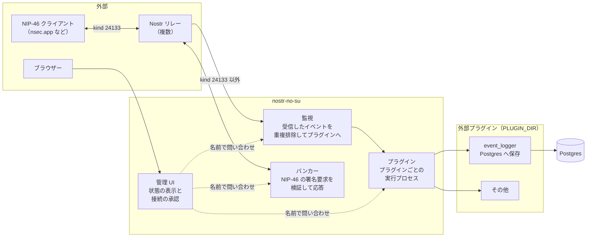
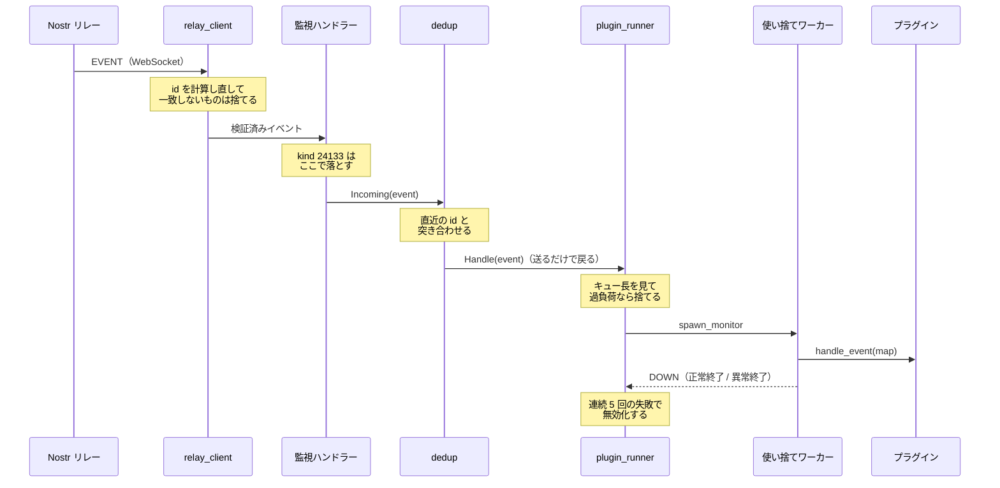
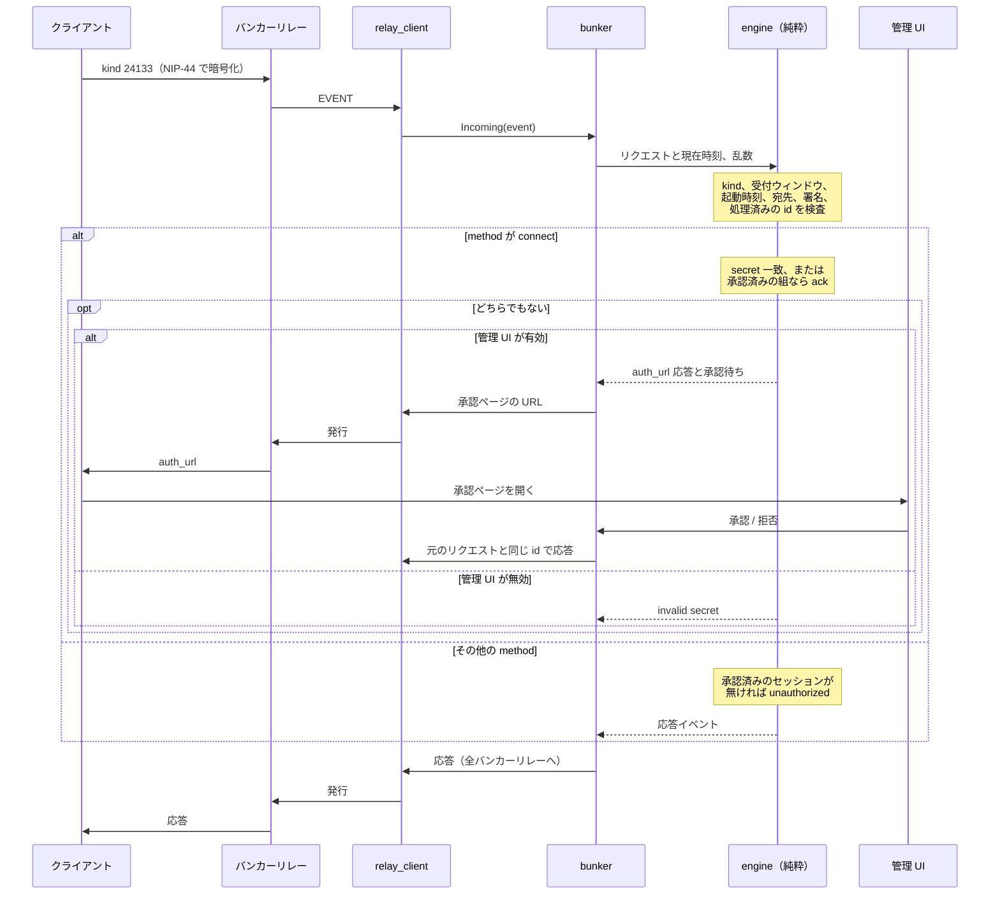
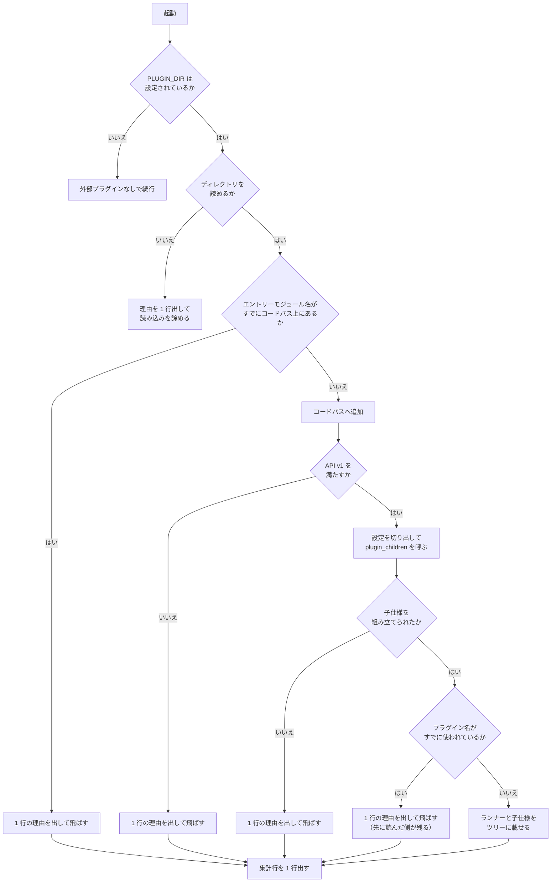

# システム構成

この文書は、nostr-no-su が何をどう組み立てて動いているかを示す。
読み手として想定するのは、この本体のコードに手を入れる開発者である。
プラグインを書くだけなら [プラグイン API v1 の仕様](plugin-api.md) を読めばよく、この文書は要らない。

扱うのは、プロセスの構造、イベントとリクエストが通る経路、プラグインの読み込み、ディレクトリの配置、設定の読み手である。
判断の理由は、その判断が他の部分の形を決めている場合にだけ添える。
それ以外の理由は各モジュールの doc コメントにあるので、そちらへ譲る。

## 全体像

本体は 4 つの独立した部分からなる。



監視とバンカーはリレーへの接続を共有しない。
`relay.nsec.app` のように kind 24133 以外の購読を拒否するリレーをバンカー専用に使えるようにするためで、`RELAY_URL` と `BUNKER_RELAY_URL` は別々に設定する。

管理 UI は他のどの部分にも依存しない。
表示する状態は名前付きアクターへの問い合わせで取るので、UI が再起動しても問い合わせ先が再起動しても、配線をやり直す必要がない。
問い合わせが失敗したときはその項目だけを「unavailable」として描画し、ページ全体は失敗させない。

## スーパービジョンツリー

常駐するプロセスはすべて `static_supervisor` の下に置く。
ツリーは起動時に 1 度だけ組み、実行中に子を足すことはしない。

ツリーの外で動くプロセスが 2 種類ある。
プラグインのイベント処理を動かす使い捨てワーカーと、`relay_connection` が所有する WebSocket のソケットプロセスである。
どちらも所有者が監視していて、死んでもスーパーバイザーの再起動許容回数を消費しない。

```
root (one_for_one, 3/60)
├── plugins      (one_for_one, 5/10)   プラグインごとのランナー
│   ├── children(<plugin>) (one_for_one, 5/10, Temporary)  子仕様を持つプラグインだけ
│   │   └── <プラグインが申告した子プロセス>
│   └── runner(<plugin>)   (worker, Permanent)
├── monitor      (rest_for_one, 5/10)  重複排除ディスパッチャー、次にリレーごとの接続
│   ├── dedup
│   └── relay_connection × 監視リレーの数
├── bunker       (rest_for_one, 5/10)  バンカーアクター、次にリレーごとの接続
│   ├── bunker
│   └── relay_connection × バンカーリレーの数
└── admin        (mist)                管理 UI の HTTP サーバー
```

監視とバンカーのサブツリーが `rest_for_one` なのは、先頭のアクターが再起動したときに後続の接続もまとめて落とすためである。
接続は復帰の過程で購読を張り直し publisher を登録し直すので、再起動したアクターが再び生きたソケットに配線される。

`plugins` サブツリーがルート直下にあってプラグインのランナーが `one_for_one` で並ぶのは、プラグイン同士が独立で、監視が無効な構成でも状態を見せたいからである。
ルートの子は `plugins` を `monitor` より先に追加する。
逆順だとディスパッチャーが未登録のランナー名へ送り、起動直後のイベントを取りこぼす。

### 再起動の許容回数に頼らない設計

ルートの `restart_tolerance(3, 60)` は、復旧できないサブツリーを抱えたままループするより、プロセスごと終了してコンテナーの再起動ポリシーに委ねるための設定である。

毎イベントでクラッシュするプラグインに対して、有限の再起動許容回数は原理的に成立しない。
どんな値を設定しても、秒間数十件のイベントが来ればサブツリーは許容回数を使い切り、ルートもやがてアプリを終了させる。
そこで、プラグインの不調でそもそもプロセスが死なないようにしている。

- プラグインのイベント処理関数は、イベント 1 件ごとの使い捨てプロセスで動かす。
  ランナーはそのワーカーとリンクを張らず監視だけを張るので、例外も異常終了もランナーには伝播しない。
- プラグインが申告した子プロセスは普通にクラッシュループしうるので、プラグイン 1 つぶんの子を専用のスーパーバイザーにまとめ、その子仕様を `Temporary` にする。

子スーパーバイザーが自分の許容回数を超えたときに親の許容回数が減らないのは、`Temporary` だからではない。
そのとき子は理由 `shutdown` で終了し、親では理由ベースの分岐に当たって再起動の記録そのものが行われないからで、これは `Transient` でも同じである。
`Temporary` を選ぶ理由は別にあって、諦めた子の仕様が親から削除されること（`Transient` は死んだまま一覧に残る）と、許容回数超過以外の理由で落ちたときに再起動されないことの 2 つである。

詳しくは `src/nostr_no_su/app.gleam` と `src/nostr_no_su/plugin_runner.gleam` の doc コメントに、OTP のどの節がそう振る舞うかの出典つきで書いてある。

## イベントが流れる経路

監視リレーから届いたイベントがプラグインに渡るまでを追う。



`relay_connection` はこの経路には現れない。
ソケットを所有して切断を検知し再接続を予約するのがその役目で、イベントそのものは `relay_client` がハンドラーへ直接渡す。
不安定なリレーがスーパーバイザーの再起動許容回数を消費しないよう、接続が死んでも道連れにならない作りにしてある。

遅いプラグインが他のプラグインへの配信を止めないのは、ディスパッチャーがランナーへ送った時点で戻り、プラグインの実行時間がそこに載らないからである。

重複排除は有界なスライディングウィンドウで行う。
複数のリレーが同じイベントを配信し、再接続のたびに保存済みイベントが再送されるため、同じ id を 2 度プラグインへ渡さないようにしている。
ウィンドウは有限なので、配信は at-least-once であって exactly-once ではない。

プラグインが受け取るのは Gleam のレコードではなく binary キーの Erlang map である。
レコードはランタイムではタプルなので、フィールドを 1 つ足すだけで既存のプラグインが黙って壊れる。
map なら Erlang や Elixir で書いたプラグインも載せられる。

## NIP-46 リクエストが流れる経路

クライアントからの署名要求は、監視とは別の接続で受ける。



判断はすべて `engine` に置いてある。
アクターが持つのはセッション状態と、乱数や現在時刻のような外界からの入力だけである。
リレークライアントは切断のたびに再起動されるため、セッション状態をそこに置けない。

応答はどのリレーから来たリクエストでも全バンカーリレーへ発行する。
クライアントは `bunker://` URI の `relay=` をすべて聴くので、リレーが 1 つ生きていれば往復が成立する。

## プラグインが読み込まれるまで

起動時に `PLUGIN_DIR` を 1 度だけ走査する。



読み込みの失敗で起動は止まらない。
弾かれるのは 1 つのプラグインだけで、監視もバンカーも他のプラグインも影響を受けない。
`PLUGIN_DIR` 自体が読めないときだけは走査に入れないので、集計行も出ない。

設定は `PLUGIN_<NAME>_<KEY>` の環境変数を集め、プラグイン名が確定した時点で接頭辞に一致するものだけを切り出して渡す。
設定が足りないときは、プラグインの `plugin_children/0` または `/1` が `{error, Reason}` を返して読み込みを拒否できる。
値の妥当性（接続文字列として解釈できるか、など）は本体には判断できないので、そこをプラグインに委ねている。

読み込んだ BEAM は本体と同じ VM で同じ権限で動く。
サンドボックスは無く、秘密鍵を持つアクターの状態にも到達できるので、信頼できるものだけを置くことになる（[プラグイン API v1](plugin-api.md) の第 1 章）。

## ディレクトリ構造

```
nostr-no-su/
├── src/                          本体
│   ├── nostr_no_su.gleam         エントリポイント（設定の読み込みとツリー仕様の組み立て）
│   ├── nostr_no_su_ffi.erl       OTP への FFI（crypto / code / file / process）
│   └── nostr_no_su/
│       ├── app.gleam             スーパービジョンツリーの構成
│       ├── config.gleam          環境変数からの設定読み込み
│       ├── admin.gleam           管理 UI の HTTP サーバーとルーティング
│       ├── admin/dashboard.gleam ダッシュボードの描画（スナップショット → HTML の純粋関数）
│       ├── dedup.gleam           リレー横断の重複排除ディスパッチャー
│       ├── dedup/window.gleam    直近のイベント id のスライディングウィンドウ（純粋）
│       ├── plugin.gleam          プラグイン API v1 の検証と読み込み
│       ├── plugin_children.gleam 子仕様の検証と ChildSpecification への変換
│       ├── plugin_config.gleam   プラグイン固有の設定の切り出し
│       ├── plugin_loader.gleam   PLUGIN_DIR の走査とコードパスへの追加
│       ├── plugin_runner.gleam   プラグイン 1 つぶんの実行プロセス
│       ├── plugins/
│       │   └── console_logger.gleam  内蔵プラグイン（受信を 1 行出す）
│       ├── bunker.gleam          バンカーのアクター（セッション状態を保持）
│       ├── bunker/engine.gleam   NIP-46 リクエスト処理の純粋コア
│       ├── bunker/rpc.gleam      JSON-RPC コーデック
│       ├── bunker/account.gleam  鍵材料と bunker:// URI
│       ├── nostr/event.gleam     Event 型・コーデック・ID 計算・署名
│       ├── nostr/filter.gleam    購読フィルター
│       ├── nostr/message.gleam   クライアントとリレーのメッセージ
│       ├── relay_client.gleam    WebSocket クライアント（stratus）
│       ├── relay_connection.gleam リレー 1 本ぶんの接続を保つアクター
│       ├── crypto/secp256k1.gleam 点演算・鍵導出・ECDH
│       ├── crypto/bip340.gleam   BIP-340 Schnorr 署名と検証
│       ├── crypto/nip44.gleam    NIP-44 v2 暗号化
│       ├── hex.gleam             16 進文字列とバイト列の相互変換
│       ├── log.gleam             ログ 1 行の組み立て
│       ├── named.gleam           名前付きアクターへの安全な送信と問い合わせ
│       ├── random.gleam          推測されては困る値のための乱数
│       └── time.gleam            現在時刻（FFI）
│
├── test/                         本体のテスト（gleeunit）
│   └── support/                  テスト用の fixture
│
├── plugins-src/                  同梱プラグインのソース
│   └── event_logger/             Postgres へ保存する（独自の依存と設定を持つ）
│       ├── gleam.toml            本体とは独立した Gleam プロジェクト
│       ├── manifest.toml         共有パッケージの版を本体に合わせて固定する
│       ├── src/
│       │   ├── event_logger.gleam       API v1 の関数と起動シム
│       │   ├── event_logger/store.gleam 保存アクターとスキーマ
│       │   └── event_logger_ffi.erl     子仕様 map の組み立て
│       └── test/
│
├── examples/plugins/             プラグインの書き方の例
│   ├── file_logger/              状態を持たず、設定を受け取る（Erlang 1 ファイル）
│   └── counter/                  子プロセスを申告する（Erlang 1 ファイル）
│
├── plugins/                      ビルド済みプラグインの置き場所（追跡しない）
│
├── docs/
│   ├── plugin-api.md             プラグイン API v1 の仕様（プラグイン作者向け）
│   └── architecture.md           この文書
│
├── vendor/stratus/               パッチ済み stratus（README を参照）
├── gleam.toml
├── Dockerfile
└── docker-compose.yml
```

`src/` と `plugins-src/` は別々の Gleam プロジェクトである。
本体は `pog` に依存せず、Postgres への保存に必要な依存は `event_logger` が自分で持つ。

`plugins/` は追跡しない。
`plugins-src/` や `examples/` のソースを本体と同じ docker イメージの中でビルドし、その成果物をここへ置く。
ホスト環境でビルドすると同梱物が変わってしまうので、ビルド手順は各プラグインの README に従う。

## 環境変数と読み手

環境変数はすべて `config.gleam` の 1 か所で読む。

| 変数 | 読み手 | 未設定のとき |
| --- | --- | --- |
| `RELAY_URL` | 監視 | `wss://relay.damus.io` を使う |
| `BUNKER_RELAY_URL` | バンカー | `RELAY_URL` と同じリレーを使う |
| `PUBKEYS` | 監視 | 直近のイベントを購読する |
| `ACCOUNT_KEYS` | バンカー | バンカーを無効にする |
| `BUNKER_SECRET` | バンカー | 起動ごとにアカウントごとの乱数を生成する |
| `PLUGIN_DIR` | プラグインローダー | 外部プラグインを読み込まない |
| `PLUGIN_<NAME>_<KEY>` | 各プラグイン | プラグインが判断する |
| `ADMIN_PORT` | 管理 UI | `8080` で待ち受ける |
| `ADMIN_BIND` | 管理 UI | `127.0.0.1` で待ち受ける |
| `ADMIN_PASSWORD` | 管理 UI | 起動ごとに乱数で生成する |
| `ADMIN_BASE_URL` | バンカー（承認ページの URL） | `http://localhost:<ADMIN_PORT>` を使う |

プラグイン固有の設定だけは本体が中身を解釈しない。
接頭辞に一致する変数を集めて map で渡すだけで、キーの必須性も値の形式もプラグインが決める。

## 関連文書

- [プラグイン API v1 の仕様](plugin-api.md)：プラグインを書く人向け。必須エクスポート、イベント map、実行モデル、設定、配置と読み込み
- [README](../README.md)：使い方、環境変数の詳細、設計上の判断と既知の制約
- `plugins-src/event_logger/README.md`：同梱プラグインのビルドと配置
