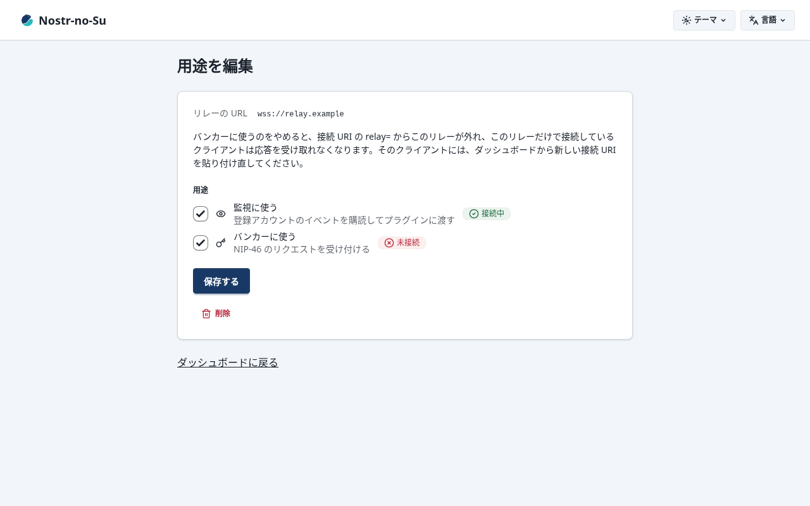
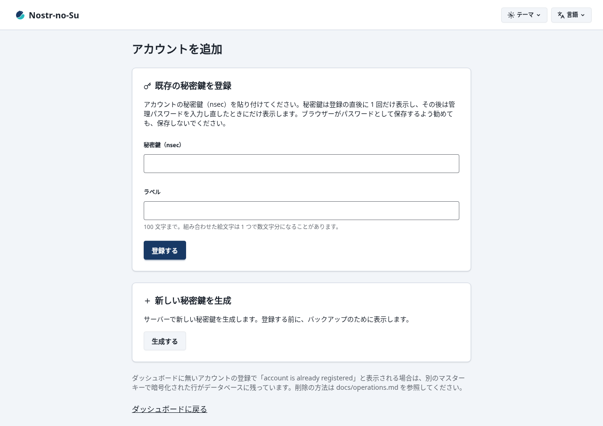
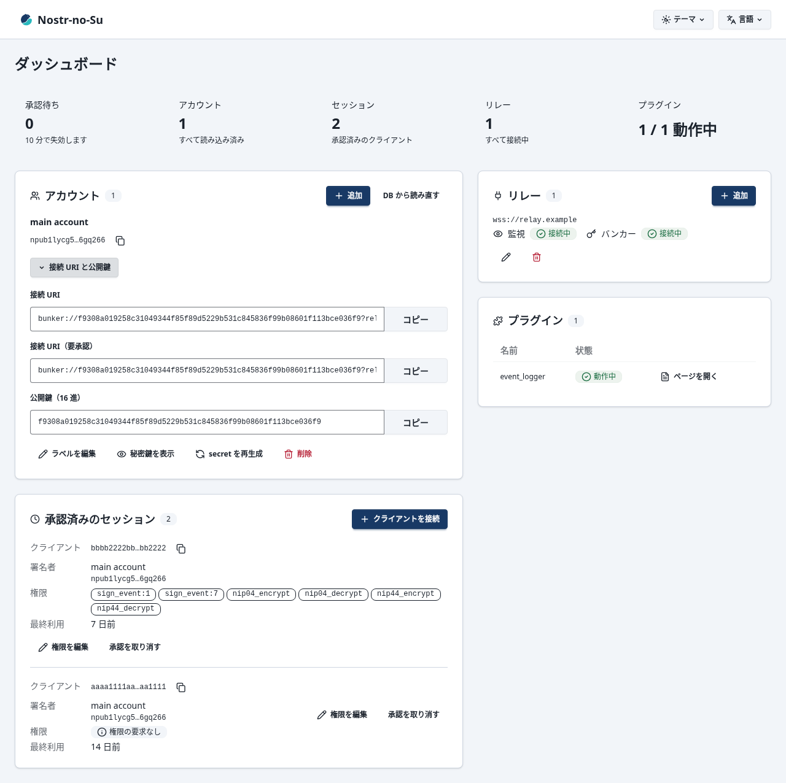
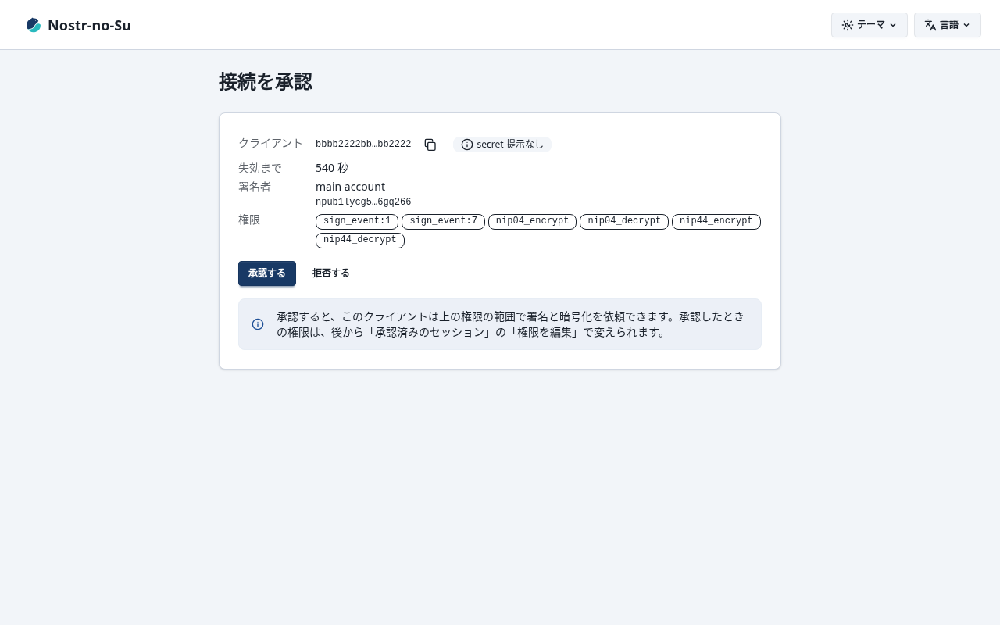
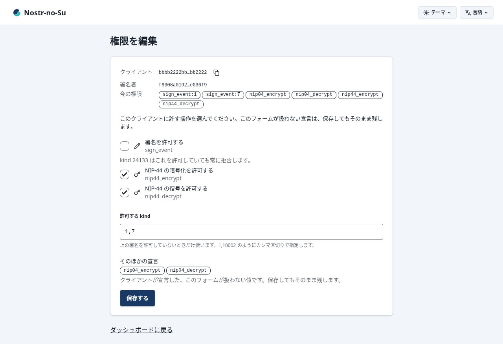
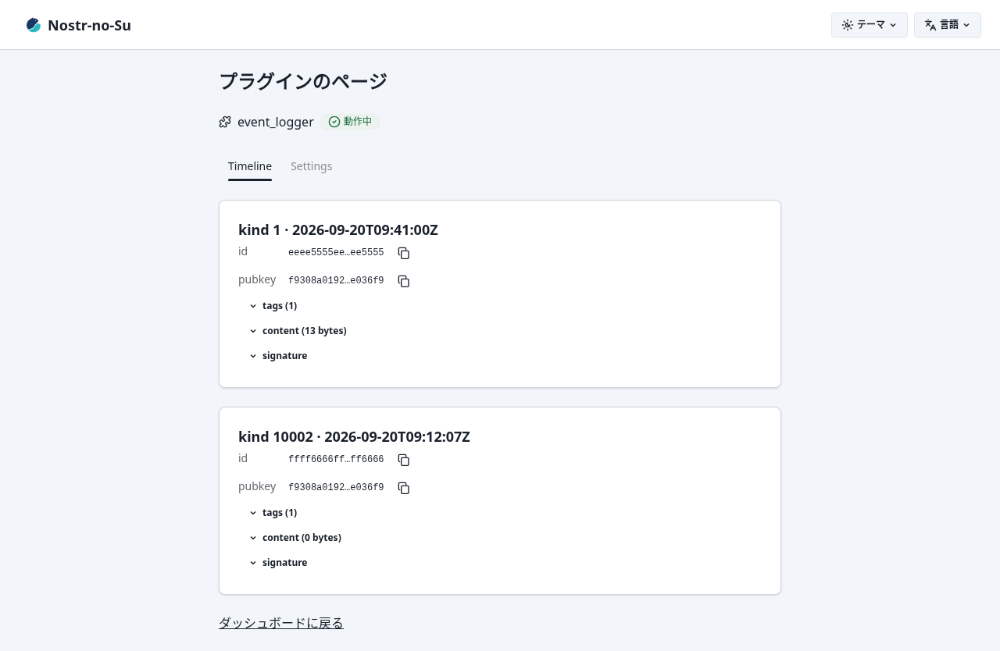
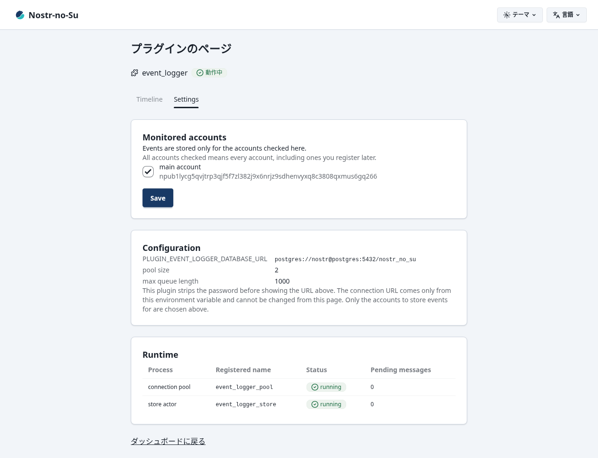

<p align="right"><a href="../README.md">English</a> | 日本語</p>

<p align="center">
  <picture>
    <source media="(prefers-color-scheme: dark)" srcset="../assets/logo/nostr-no-su-color-dark.svg">
    
  </picture>
</p>

<h1 align="center">Nostr-no-Su</h1>

<p align="center">
  Nostr のリモート署名バンカー（NIP-46）兼、自分のイベントを処理するユーティリティサーバー。Gleam / BEAM 製。
</p>

<p align="center">
  <a href="https://github.com/neverclear86/nostr-no-su/actions/workflows/ci.yml"></a>
  <a href="https://github.com/neverclear86/nostr-no-su/releases"></a>
  <a href="https://github.com/neverclear86/nostr-no-su/pkgs/container/nostr-no-su"></a>
  
  
  <a href="../LICENSE"></a>
</p>

秘密鍵をクライアントに渡さず、`bunker://` URI で接続したクライアント（nsec.app、noStrudel など）からの署名要求にサーバーが応える。あわせて、登録したアカウントのイベントをリレーから監視し、プラグインで処理する（同梱の `event_logger` は Postgres に保存する）。docker compose で Postgres ごと立ち上がり、管理 UI から鍵とリレーを操作する。

## ✨ 特徴

- **NIP-46 バンカー**: `connect` / `get_public_key` / `sign_event` / `ping` / `nip44_encrypt` / `nip44_decrypt` / `logout` に応える。複数アカウントの鍵を 1 台で預かり、複数のリレーに専用の接続を張る（どれか 1 つ生きていれば署名できる）。secret を持たないクライアントは管理 UI の承認（`auth_url` フロー）を経て接続する
- **鍵は暗号化して保存**: 秘密鍵と接続 secret はマスターキー（`ACCOUNT_MASTER_KEY`）で AES-256-GCM により暗号化して Postgres に置く。署名と暗号化は `connect` で宣言された権限（管理 UI で編集できる perms）の範囲だけを許し、perms を宣言しないクライアントには kind 24133 を除く署名と NIP-44 の暗号化・復号を許す
- **自前の暗号実装**: BIP-340 Schnorr 署名と NIP-44 v2 暗号化を Gleam で実装し、公式のテストベクターに一致する。プリミティブは OTP の `crypto`（OpenSSL）で、NIF は要らない
- **イベント監視とプラグイン**: 登録した全アカウントのイベントを複数リレーから集め、検証と重複排除をしてプラグインに渡す。プラグインは専用プロセスで動き、落ちても本体を巻き込まない。BEAM のモジュールを置くだけで自作のプラグインを足せる（[プラグイン API v1](plugin-api.md)）
- **管理 UI**: アカウントの登録（nsec の入力かサーバーでの生成）、接続 URI の表示、接続の承認、セッションの権限の編集と取り消し、リレーの追加と用途の編集、プラグインの状態を 1 画面で扱う。日本語と英語、ライトとダークに対応し、外部のファイルは読まない
- **止まらない**: OTP のスーパービジョンツリーの下で、リレーの接続は個別に自動再接続し、DB が落ちてもバンカーは再試行を続け、アカウントの追加と削除は再起動なしで反映する

## 🚀 はじめる

必要なのは docker（compose v2）と、ファイルを取る `curl`、`setup-env.sh` が鍵を生成するのに使う `openssl` である。公開イメージ `ghcr.io/neverclear86/nostr-no-su` は `linux/amd64` と `linux/arm64` の両方を含むので、x86_64 のサーバーでも Raspberry Pi や Apple Silicon でも同じ手順で動く。

### 公開イメージから動かす

リポジトリの clone は要らない。3 つのファイルを取り、`.env` を作って起動する。`<version>` は公開済みのリリースの版（`X.Y.Z`。[Releases](https://github.com/neverclear86/nostr-no-su/releases)）に置き換える。

```sh
mkdir nostr-no-su && cd nostr-no-su
base=https://raw.githubusercontent.com/neverclear86/nostr-no-su/v<version>
curl -fsSLO "$base/docker-compose.release.yml"
curl -fsSLO "$base/.env.example"
curl -fsSLO "$base/setup-env.sh"
mkdir -p plugins
sh setup-env.sh
docker compose -f docker-compose.release.yml up -d
```

`setup-env.sh` は `.env.example` を `.env` に複製し、必須の 2 つ（マスターキー `ACCOUNT_MASTER_KEY` と管理パスワード `ADMIN_PASSWORD`）を生成した値で埋めて `.env` を 600 にする。`mkdir -p plugins` は自作プラグインの置き場所で、空でもよい（compose がマウントするので、無いと docker が root 所有で作る）。取るイメージのタグは `latest` で、`curl` した版に固定するときは `.env` に `NOSTR_NO_SU_VERSION=<version>` を書く。この構成では `logs` や `exec` も毎回 `-f docker-compose.release.yml` が要る。

### ソースからビルドして動かす

```sh
git clone https://github.com/neverclear86/nostr-no-su.git && cd nostr-no-su
sh setup-env.sh
docker compose up --build -d
```

### 最初の設定

1. ブラウザーで `http://127.0.0.1:8080/` を開く。ユーザー名は `admin`、パスワードは `.env` の `ADMIN_PASSWORD` の値である。
   
2. ダッシュボードのリレーの節の「追加」から、バンカーに使うリレー（`wss://relay.nsec.app` などの NIP-46 向けのリレーを推奨）と、監視に使うリレーを登録する。登録すると再起動なしで接続が開く。
   
3. アカウントの節の「追加」で、nsec を貼り付けて登録するか、サーバーに鍵を生成させる。生成した場合は、確認ページの nsec をバックアップしてから登録する（以後は管理パスワードを再入力したときにしか表示しない）。
   
4. アカウントの行の「接続 URI と公開鍵」を開き、「接続 URI」をコピーしてクライアントに貼り付ける。secret を持たない「接続 URI（要承認）」で接続すると、管理 UI での承認を経る。
   
   
5. クライアントが接続した後は、「承認済みのセッション」の行の「権限を編集」から、そのクライアントに許す操作を変えられる。署名と NIP-44 の暗号化・復号のチェックで選び、一部の種別だけ署名を許すときは署名のチェックを外して「許可する kind」に種別を並べる。書き換えは次のリクエストから効き、クライアントは接続し直さなくてよい。
   
6. 同梱の `event_logger` プラグインは、プラグインの節に 2 つのページを足す。「Timeline」は保存したイベントの一覧、「Settings」はイベントを保存するアカウントの選択と、接続先と動いているプロセスの状態である。
   
   

登録したアカウントには再起動なしで接続できる。secret も暗号化して保存するので、再起動しても接続 URI は変わらない。画面の構成と操作ごとの結果は [管理 UI](admin-ui.md)、起動時のログの読み方は [運用](operations.md) の「起動時のログ」にある。

ローカルで `gleam run` する場合は、Postgres を用意して `DATABASE_URL`、`ACCOUNT_MASTER_KEY`、`ADMIN_PASSWORD` を環境変数で渡す（[開発](development.md)）。

## ⚙️ 設定

設定はすべて環境変数で、docker compose では `.env` に書く。`.env` に書く必要があるのはマスターキーと管理パスワードだけで、ほかは既定値で動く。よく変えるものは次のとおりで、`.env.example` の該当の行の「# 」を外して書き換える。

| 変数 | 既定 | 用途 |
| --- | --- | --- |
| `ADMIN_PORT` | `8080` | 管理 UI のポート。空にすると管理 UI を無効にする |
| `ADMIN_BASE_URL` | `http://localhost:<ADMIN_PORT>` | 承認ページの URL の土台。リバースプロキシーで公開するときはその公開 URL |
| `POSTGRES_USER` / `POSTGRES_PASSWORD` / `POSTGRES_DB` | `nostr` / `nostr` / `nostr_no_su` | 同梱の Postgres の資格情報。効くのは `postgres-data` volume が空の初回だけで、起動した後に変えるとアプリの接続が拒否される |

全部の変数の表、秘密をファイルで渡す方法（`<変数>_FILE`）、リバースプロキシーの置き方、コンテナーの構成（読み取り専用のルート、`/tmp`、remsh、ログ）は [設定](configuration.md) にある。

## 🔐 安全に使うために

- **マスターキーを失うと鍵が戻らない**: `ACCOUNT_MASTER_KEY` を失うと、保存した全アカウントの秘密鍵を復号できなくなる（DB だけでは戻せない）。逆に、DB のダンプとマスターキーが揃うと全アカウントの秘密鍵が漏れる。マスターキーはバックアップと別の場所に保管し、バージョン管理に含めないこと（[運用](operations.md) の「マスターキーの保管」、交換の手順は同じ文書の「マスターキーの交換」）。
- **管理 UI は平文 HTTP**: Basic 認証の資格情報も、署名権限そのものである secret 入りの `bunker://` URI も暗号化されずに流れる。同梱の compose はホストのループバック（`127.0.0.1:8080`）にだけ公開する。外部から使うときは TLS を終端するリバースプロキシーを前に置くこと（[設定](configuration.md) の「リバースプロキシーの設定」）。認証の試行回数の制限は持たないので、推測されにくいパスワードを使う。
- **プラグインは本体と同じ権限で動く**: `PLUGIN_DIR` に置いた BEAM は本体と同じ VM で動き、秘密鍵を持つプロセスにも到達できる。サンドボックスは無い。信頼できるものだけを置き、第三者から受け取ったプラグインはソースを読んでから置く。
- **秘密鍵の表示と削除**: 管理 UI で秘密鍵を表示するとログに `[admin] revealed the private key of <npub>` が残る。アカウントを削除すると DB からも鍵が消え、ほかに保存していない鍵は戻らない。コピーした nsec や接続 URI はクリップボードに残るので、貼り付けた後は消す。
- **`REMSH_ENABLED=true` は使うときだけ**: コンテナーに exec できる者が復号した秘密鍵を含む VM の全てに到達できる。既定は無効で、使うときだけ有効にする。

v0.1 でのセキュリティの前提と、あえて対策していない項目は [設計上の判断と既知の制約](design-decisions.md) の「v0.1 のセキュリティの前提」にある。

## 🔄 更新とバックアップ

データは compose の `postgres-data` volume にあり、イメージを入れ替えても消えない。DB のスキーマの移行は起動時に自動で進む（前へ戻す移行は無い）。上げる前にダンプを取る。ソースからビルドして動かしている構成では `-f docker-compose.release.yml` を外し、`up -d` に `--build` を付ける（`pull` は `git pull` に読み替える）。

```sh
docker compose -f docker-compose.release.yml exec -T postgres pg_dump -U nostr -d nostr_no_su -Fc > nostr-no-su-$(date +%Y%m%d).dump
docker compose -f docker-compose.release.yml pull
docker compose -f docker-compose.release.yml up -d
```

新しい版で `docker-compose.release.yml` や `.env.example` が変わっているときの取り直し、volume の名前の決まり、ダンプからの復旧と復旧後の確認は [運用](operations.md) にある。版ごとの変更は [変更履歴](../CHANGELOG.md) に書く。

## 🧩 プラグイン

同梱の `event_logger` は、監視で受信したイベントを Postgres の `events` テーブルに保存する（NIP-01 の全フィールド、`tags` は jsonb、取り込み時刻。同じイベントを複数のリレーから受け取っても 1 行）。compose の既定の構成ではそのまま動き、保存済みのイベントの直近 20 件は管理 UI の `/plugins/event_logger/timeline`、保存の状態は `/plugins/event_logger/settings` で見られる。保存の対象とするアカウントは `/plugins/event_logger/settings` で選べる（初期値は全アカウント）。ソースと改造版のビルドは [`plugins-src/event_logger/`](../plugins-src/event_logger/README.md) にある。

自作のプラグインは Erlang か Gleam で `plugin_api_version/0`、`plugin_name/0`、`handle_event/1` か `handle_event/2`（設定を受け取る形。どちらか一方でよい）をエクスポートするモジュールを書き、`./plugins` に置く。仕様は [プラグイン API v1](plugin-api.md)、例は [`examples/plugins/`](../examples/plugins/)（状態を持たない `file_logger` と、状態を持つ `counter`）にある。

## 🪺 名前の由来

名前は「Nostrの巣」。鍵とイベントを置く、自分のための拠点です。

加えて、no-su には No Secret Uploads の意味を掛けている。クライアントへ秘密鍵を渡さず、署名だけを委任できることを表す。

## 📚 文書

- [設定](configuration.md)：環境変数の表、`.env`、秘密をファイルで渡す、リバースプロキシー、docker compose の構成
- [運用](operations.md)：起動時のログ、バックアップ、版の更新、復旧、マスターキーの保管と交換
- [管理 UI](admin-ui.md)：画面の構成、アカウントの操作と結果、接続の承認（auth_url フロー）
- [プラグイン API v1](plugin-api.md)：プラグインを書くための仕様
- [設計上の判断と既知の制約](design-decisions.md)：本体の形を決めた判断とその理由、残っている制約
- [システム構成](architecture.md)：プロセス、イベントとリクエストの経路、ディレクトリ構造、設定の読み手
- [開発](development.md)：ローカルでの実行とテスト、テストの流儀、管理 UI の CSS のビルドと画面の撮影
- [貢献の手引き](../CONTRIBUTING.md)：変更の出し方、版数の方針、リリースの手順
- [変更履歴](../CHANGELOG.md)：リリースごとの変更

## 🛠 開発に参加する

Gleam 1.17.0 / OTP 29 で開発している。ローカルでの実行とテスト、CI の検査は [開発](development.md) と [貢献の手引き](../CONTRIBUTING.md) にある。issue と PR を歓迎する。

## ライセンス

このリポジトリのライセンスは [MIT License](../LICENSE) である。
`vendor/stratus/` は Apache License 2.0 の stratus を改変したもので、帰属は [NOTICE](../NOTICE)、改変の記録は [vendor/stratus/PATCH.md](../vendor/stratus/PATCH.md) にある。
管理 UI のアイコンは、上部バーと favicon の製品のロゴを除いて、ISC ライセンスの [Lucide](https://lucide.dev) のストロークを写したもので、帰属は [NOTICE](../NOTICE) にある。ロゴはこのリポジトリのもので、[MIT License](../LICENSE) に従う。
