# 使い方

docker compose で立ち上げた Nostr-no-Su を、管理 UI で日々使うまでの手引き。
起動と `.env` の作り方は [README](../README.ja.md) の「インストール」にある。
画面の細かい仕様は [管理 UI](admin-ui.md)、バックアップと復旧は [運用](operations.md)。

## 何ができるか

- **バンカー**：クライアントは `bunker://` URI で接続し、署名と NIP-44 の暗号化を依頼する。秘密鍵はクライアントに渡らない
- **監視**：登録した全アカウントのイベントを、監視用のリレーから受け取る。複数のリレーから届いても 1 回にまとめる
- **プラグイン**：受け取ったイベントをプラグインに渡す。同梱の `event_logger` は Postgres に保存する

鍵は Postgres に、起動時に渡すマスターキーで暗号化して保存する。
失ってはいけないのは DB とマスターキーの 2 つ（[守ること](#守ること)）。

## 起動する

README の手順で `docker compose up -d` したら、ログに次の行が出れば起動している（初回は 0 件）。

```
[bunker] loaded 0 account(s)
```

`[main] cannot start: <理由>` が繰り返し出るときは、`.env` の必須の値が空か形式違い。理由の行に変数名が出る。

`http://127.0.0.1:8080/` を開く。ユーザー名は `admin`、パスワードは `.env` の `ADMIN_PASSWORD`。

この文書の `docker compose ...` は `.env` のあるディレクトリーで実行する。公開イメージの構成でも、README の手順で `.env` に書いた `COMPOSE_FILE` があるので `-f` は要らない。

## 最初の設定

クライアントがつながるまでに要るのは、リレーとアカウントの登録の 2 つ。
リレーが先だと、アカウントの接続 URI に最初からリレーが入る。

### ダッシュボードの見方

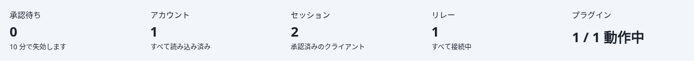

上部の概要の帯の項目は同じページの節へのリンク。承認待ちが 1 件以上あると承認待ちの項目が主の色で塗られ、要対応の補足（未接続、読み込み失敗など）は警告色かエラーの色になる。
その下に、左列にアカウントとセッション、右列にリレーとプラグインが並ぶ。
承認待ちがあるときだけ、その上に「承認待ちの接続」の節が出て、30 秒ごとに読み込み直す。

### 1. リレーを登録する

リレーの節の「追加」から URL を入れる。

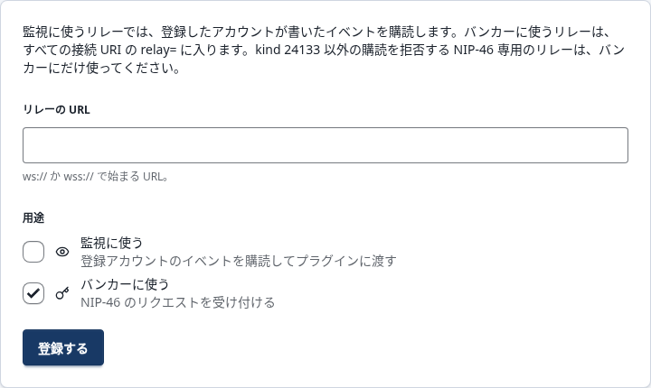

- **監視**：自分のイベントを受け取るリレー。普段投稿しているリレー
- **バンカー**：クライアントとの署名の往復に使うリレー。`wss://relay.nsec.app` のような NIP-46 向けのリレーを推奨

既定では「バンカー」だけにチェックが入っている。自分のイベントを受け取るリレーでは「監視」にもチェックを入れる。
NIP-46 専用のリレーは kind 24133 以外の購読を拒否するので、「監視」は外したままにする。
`relay.damus.io` のようにレート制限が厳しいリレーは、連続した署名要求の応答を落とすことがある。

登録すると再起動なしで接続が開く。バンカー用のリレーを複数登録すると、どれか 1 つが生きていれば署名できる。

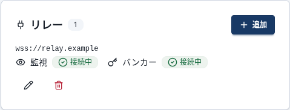

### 2. アカウントを登録する

アカウントの節の「追加」を開く。

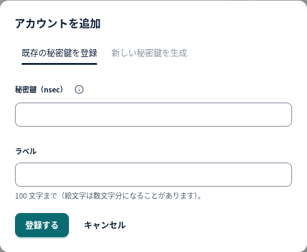

- **既存の秘密鍵を登録**：手元の nsec を貼り付ける。完了ページに nsec が一度だけ出るので、貼り間違いを確かめる
- **新しい秘密鍵を生成**：サーバーに鍵を作らせる。確認ページの nsec をバックアップしてから「この鍵を登録する」を押す

登録後に nsec を見るには、管理パスワードの再入力が要る（[日々の操作](#日々の操作)）。

### 3. 接続 URI をコピーする

アカウントの行の「接続 URI と公開鍵」を開くと、3 つのコピー欄が出る。

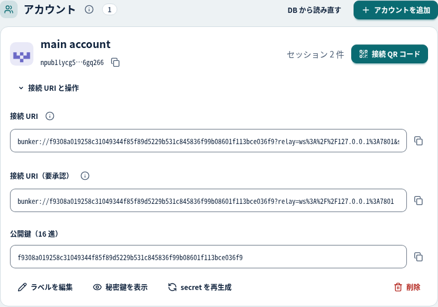

| 欄 | 使いどころ |
| --- | --- |
| 接続 URI | 自分のクライアントに貼る。secret 入りなので承認なしでつながる |
| 接続 URI（要承認） | 他人や信用度の低い端末に渡す。最初の接続で管理画面の承認を経る |
| 公開鍵（16 進） | クライアントが hex を求めるとき |

スマートフォンに渡すときは、アカウントの行の「接続 QR コード」から接続 QR コードのページを開く。各カードの上のコードは端末のカメラ用で、読み取ったテキストをコピーし、クライアントの入力欄に `bunker://` と打ってからその後ろに貼る。クライアント自身の読み取り機能を使うときは、下の畳みを開いてその中のコードを読み取る。

secret 入りの URI は署名権限そのもの。チャットに貼らず、貼り付けた後はクリップボードから消す。

## クライアントをつなぐ

つなぎ方は 3 通り。クライアントが受け付ける入力で選ぶ。

| 方法 | 手順 | 向き |
| --- | --- | --- |
| secret 入りの `bunker://` | 「接続 URI」をクライアントの bunker の欄に貼る。承認は要らない | 自分の端末 |
| secret 無しの `bunker://` | 「接続 URI（要承認）」を貼る。クライアントに承認ページの URL が返るので、開いて承認する | 他人に渡す、共有端末 |
| `nostrconnect://` | クライアントが出した URI を、セッションの節の「クライアントを接続」に貼り、署名するアカウントを選ぶ。URI のリレーはバンカー用途で登録される | クライアントが URI を出す側のとき |

### 承認の画面

secret 無しの URI で接続すると、クライアントに承認ページの URL が返る。誰が何を要求しているかが出る。

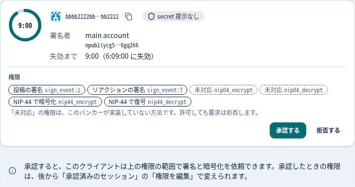

承認待ちはダッシュボードの「承認待ちの接続」からも承認と拒否ができる。10 分で失効する。

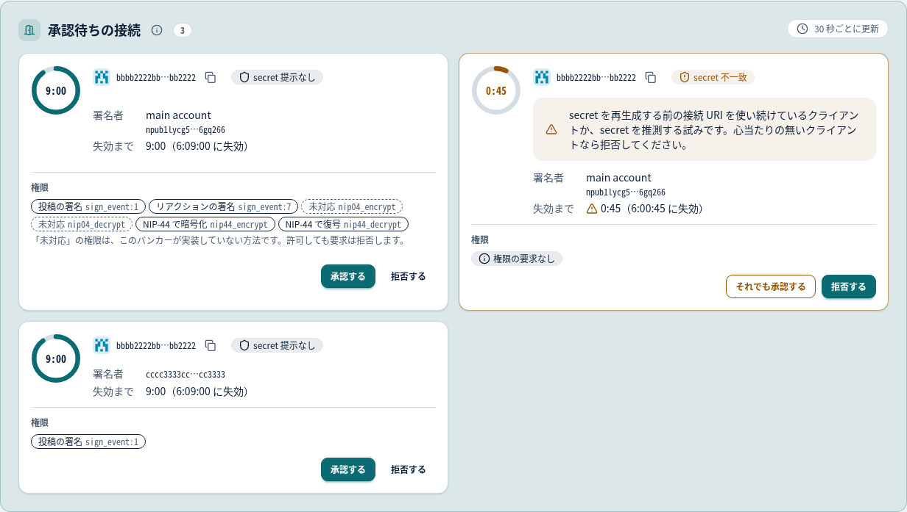

「secret 不一致」のバッジは、secret を再生成する前の古い URI で接続してきたクライアント（または推測の試み）。

承認ページの URL は `ADMIN_BASE_URL`（既定 `http://localhost:<ADMIN_PORT>`）から組み立てる。
クライアントが別の端末にあるときは、その端末から開ける URL を `.env` の `ADMIN_BASE_URL` に書く。

### 権限

クライアントは接続時に、使いたい操作を権限（perms）として宣言する。バンカーはその範囲だけを許す。

| 権限 | 許す操作 |
| --- | --- |
| `sign_event` | 全 kind の署名（バンカーの通信 kind 24133 だけは常に拒否） |
| `sign_event:1` | kind 1 だけの署名。kind ごとに 1 つずつ |
| `nip44_encrypt` / `nip44_decrypt` | NIP-44 の暗号化と復号（DM など） |
| （宣言なし） | `sign_event` と NIP-44 の両方を許したのと同じ |

権限は「承認済みのセッション」の「権限を編集」で後から変えられる。次のリクエストから効き、クライアントの接続し直しは要らない。

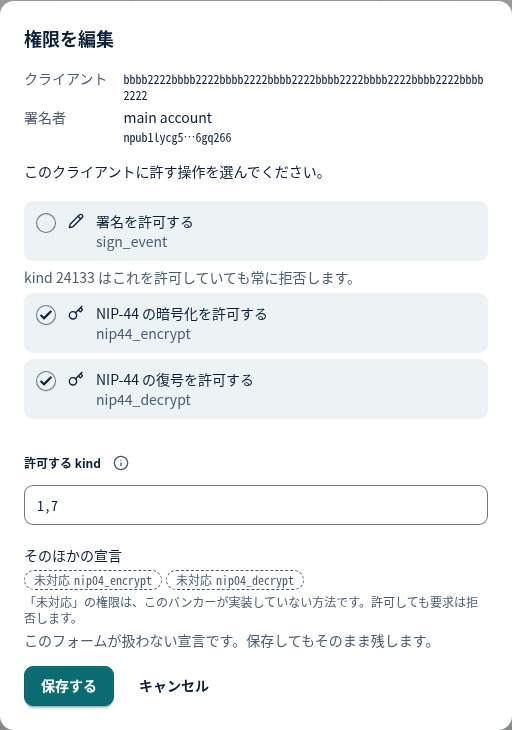

署名を許さず一部の kind だけ許すときは、署名のチェックを外して「許可する kind」に並べる。
全部を拒否したいときは「承認を取り消す」。

NIP-04 だけを使う古いクライアントには対応していない。

### 承認済みのセッション

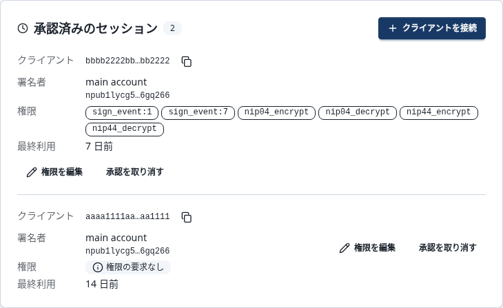

一度承認したクライアントは、secret 無しで接続し直しても承認を求められない。
「承認を取り消す」で、次の接続から再び承認が要る。
セッションは DB に保存され、再起動しても残る。上限は 32 件で、超えると最終利用の古いものから押し出される。

## 日々の操作

アカウントの行の 5 つのボタン。「接続 QR コード」以外はどれも確認ページを経て実行する。

| 操作 | 何が起きるか | クライアントへの影響 |
| --- | --- | --- |
| 接続 QR コード | 接続 URI と接続 URI（要承認）を、カメラ用とクライアントの読み取り機能用の 2 通りの QR コードで出す。確認ページは無い | 無し |
| ラベルを編集 | 画面上の呼び名を変える | 無し |
| 秘密鍵を表示 | 管理パスワードを再入力すると nsec を表示する。ログに記録が残る | 無し |
| secret を再生成 | 接続 secret を作り直し、`bunker://` URI が変わる | 古い URI での新規接続は承認待ちになる。承認済みのセッションは残る |
| 削除 | バンカーと DB から鍵を消す | そのアカウントのセッションと承認待ちも消える。nsec を控えていなければ鍵は戻らない |

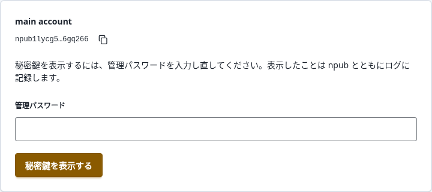

表示した後はそのタブを閉じる（履歴から POST を再送できるため）。

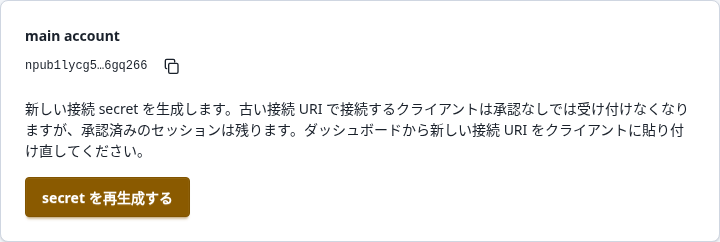

リレーの用途は行の編集アイコンから変える。URL 自体は変えられないので、別の URL にするときは追加してから古い方を削除する。

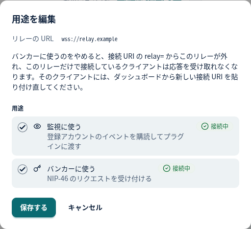

### 表示の切り替え


右端でテーマ（ブラウザーの設定、ライト、ダーク）と言語（ブラウザーの設定、English、日本語）を切り替える。cookie に 365 日保存する。

### プラグインの状態

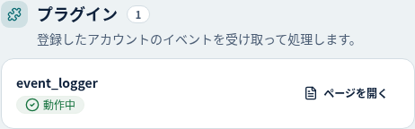

- **動作中**：正常
- **過負荷**：処理が追いつかず、届いたイベントを捨てている。追いつけば戻る
- **無効**：連続して失敗したので止めた。原因を直してから「再有効化」
- **応答なし**：状態の問い合わせに間に合わなかった。読み込み直して変わらなければログを見る

起動時に読み込めなかったプラグインがあると、概要のプラグインの補足にエラーの色で「読み込み失敗 N」が出て、プラグインの節の下に「読み込めなかったプラグイン」のカードが出る。
カードには候補のモジュール名かディレクトリー名と理由が英語のまま並ぶ（ログの `[plugin_loader]` の行と同じ文）。
理由を直してから再起動する（`.env` の設定を直したときは `docker compose up -d`、`./plugins` の中身を直したときは `docker compose restart nostr-no-su`）。

## イベントを保存する（event_logger）

同梱の `event_logger` は、監視で受け取った自分のイベントを同じ Postgres の `events` テーブルに保存する。
compose の既定の構成ではそのまま動き、設定は要らない。

プラグインの節の `event_logger` の行にあるアイコンのボタン「ページを開く」で「Timeline」が開き、ページの上のタブで「Settings」に移れる。

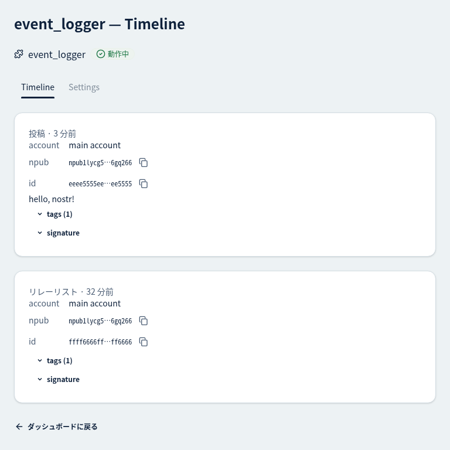

「Timeline」は保存済みのイベントの直近 20 件。

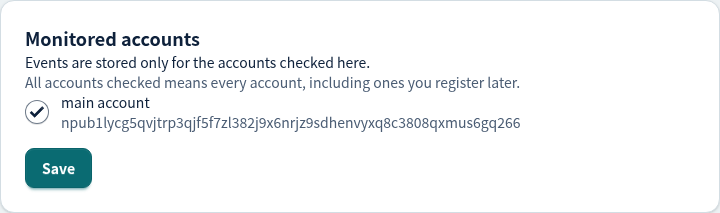

「Settings」で保存の対象にするアカウントを選ぶ（初期値は全アカウント）。接続先と動いているプロセスもここに出る。

保存されるのは登録アカウントが作った、ephemeral でないイベントだけ。バンカーの通信（kind 24133）は保存されない。

自作のプラグインは `plugins/<名前>/` に置く（[プラグイン API v1](plugin-api.md)）。
置いた BEAM は本体と同じ VM、同じ権限で動き、秘密鍵を持つプロセスにも到達できる。信頼できるものだけを置く。

## 守ること

- **マスターキー**：`.env` の `ACCOUNT_MASTER_KEY`。DB のどこにも無く、失うと秘密鍵と secret を復号できない。DB のバックアップとは別の場所に置く（両方が揃うと全鍵が漏れる）
- **Postgres のデータ**：アカウント、リレー、セッション、保存したイベント。`docker compose down -v` で消える。定期的にダンプを取る

```sh
docker compose exec -T postgres pg_dump -U nostr -d nostr_no_su -Fc > nostr-no-su-$(date +%Y%m%d).dump
```

復旧、版の更新、マスターキーの交換は [運用](operations.md)。
外に公開するときのリバースプロキシーと、秘密をファイルで渡す方法は [設定](configuration.md)。

## 困ったとき

| 症状 | 原因と対処 |
| --- | --- |
| ログに `[main] cannot start: …` が繰り返し出る | `.env` の必須の値が空か形式違い。直して `docker compose up -d` |
| 「読み込めなかったアカウント」が出る。ログに `skipped account` | 今のマスターキーで復号できない行がある。マスターキーを変えていないかを先に疑う。意図して変えたなら [運用](operations.md) の「マスターキーの交換」 |
| 登録で「このアカウントはすでに登録されています。」（`account is already registered`）なのに一覧に無い | 上と同じ行が残っている。「読み込めなかったアカウント」の「削除」で消してから登録し直す |
| ログに `skipped a bunker_sessions row with a mismatched MAC`（`bunker_pending` も同じ形） | 今のマスターキーで MAC が合わない行を飛ばした。マスターキーを変えたなら、「読み込めなかったアカウント」の「削除」で一緒に消える（[運用](operations.md) の「マスターキーの交換」）。変えていないなら DB の行が書き換えられたか持ち込まれたので、DB に書ける経路（`DATABASE_URL` の資格情報、バックアップ）を確かめ、`docker compose exec postgres psql -U nostr -d nostr_no_su -c "DELETE FROM <ログの表の名前> WHERE signer = '<署名者>' AND client = '<クライアント>'"` で消す（[設計上の判断と既知の制約](design-decisions.md) の「DB への書き込みと行の MAC」） |
| クライアントが接続できない | バンカー用のリレーが無いか未接続。secret を再生成する前の URI を使っている（承認待ちに「secret 不一致」で出る） |
| 接続はできるが署名や DM が拒否される | 権限が足りない。セッションの「権限を編集」で足す。NIP-04 のみのクライアントは非対応 |
| 承認ページの URL が開けない | `ADMIN_BASE_URL` がクライアントの端末から到達できる URL になっていない |
| ボタンを押すと全部 400 | リバースプロキシーが `Host` を書き換えている。ブラウザーの値をそのまま渡す |
| 「変更を確認できませんでした」のページ | DB に書けたか確かめられなかった。再読み込みで再送せず、ダッシュボードで反映を見る |
| DB を止めた、落ちた | 署名と監視は続く。変更の操作だけが通らない。戻れば最長 2 分で `account store is back` が出る |
| プラグインが「無効」 | ログの `[plugin <名前>]` の行に理由がある。直してから「再有効化」 |
| 「読み込めなかったプラグイン」が出る。概要に「読み込み失敗 N」 | 起動時にそのプラグインを読み込めなかった。カードの理由（ログの `[plugin_loader]` の行）を直して、`.env` なら `docker compose up -d`、`./plugins` の中身なら `docker compose restart nostr-no-su` |

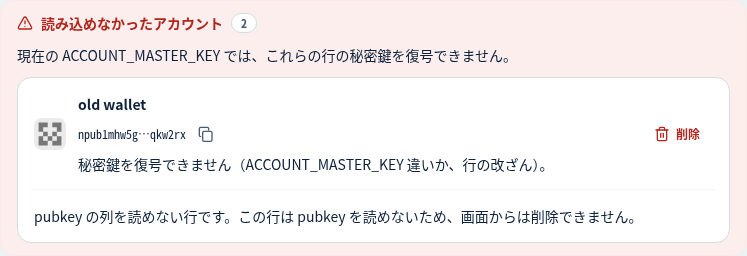

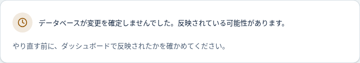

ログは `docker compose logs nostr-no-su` で見る。`warning` は失敗したが動き続けている、`error` は止まったこと。秘密鍵と `bunker://` URI はログに出ない。

## 設定の早見表

`.env` で変える値のうち、利用者が触るもの。全部の変数は [設定](configuration.md) の「環境変数」にあり、`COMPOSE_FILE` は同じ文書の「docker compose の構成」にある。

| 変数 | 既定 | 意味 |
| --- | --- | --- |
| `ACCOUNT_MASTER_KEY` | （必須） | 鍵を暗号化するマスターキー。`setup-env.sh` が生成 |
| `ADMIN_PASSWORD` | （必須） | 管理画面のパスワード。ユーザー名は `admin` |
| `ADMIN_PORT` | `8080` | 管理画面のポート。空にすると管理画面と承認フローが無効 |
| `ADMIN_BASE_URL` | `http://localhost:<ADMIN_PORT>` | 承認ページの URL の土台 |
| `PLUGIN_CONSOLE_LOGGER_ENABLED` | `true` | 受信したイベントを 1 件 1 行でログに出す内蔵プラグイン |
| `REMSH_ENABLED` | `false` | デバッグ用のリモートシェル。通常は触らない |
| `NOSTR_NO_SU_VERSION` | `latest` | 公開イメージの版。README の手順が取った版を書く。patch も追うなら `X.Y` |
| `COMPOSE_FILE` | （空） | docker compose が読むファイル。README の手順が `docker-compose.release.yml` を書く。override を重ねるなら `docker-compose.release.yml:docker-compose.override.yml` |
